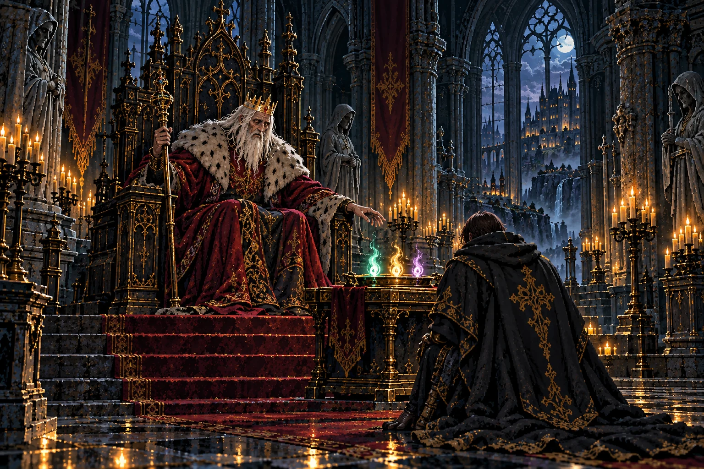
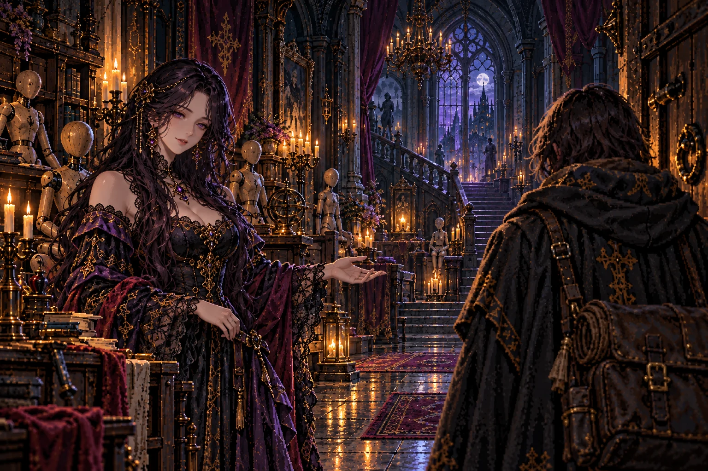
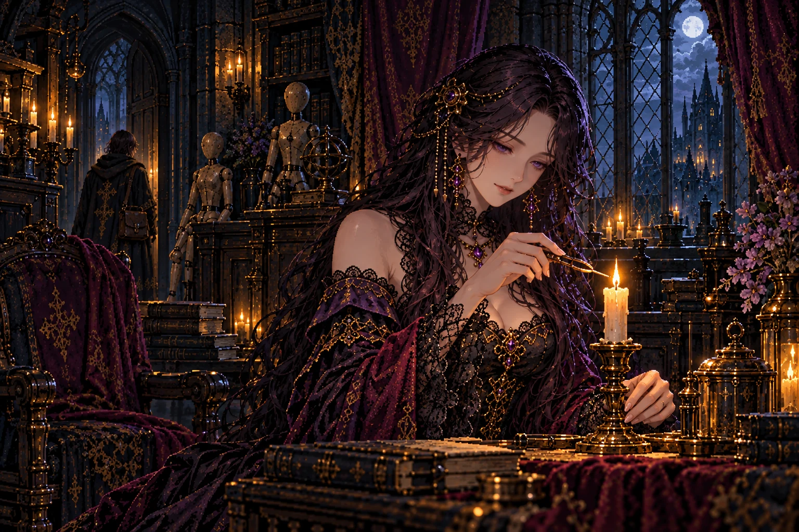
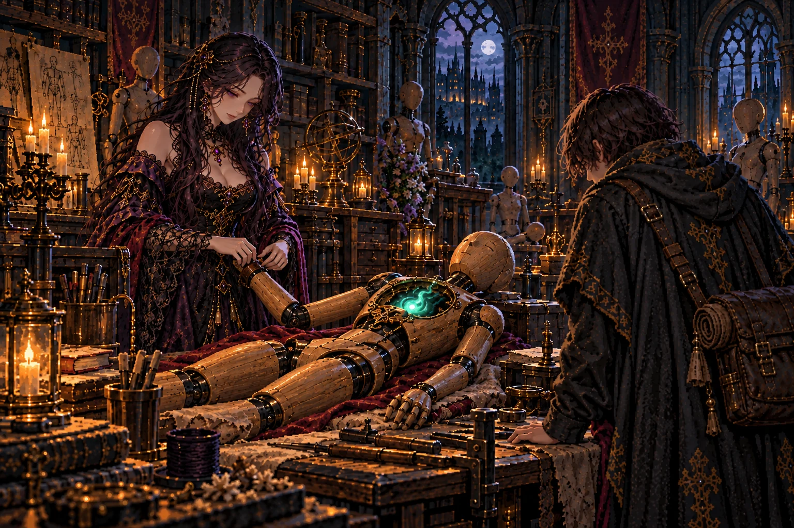
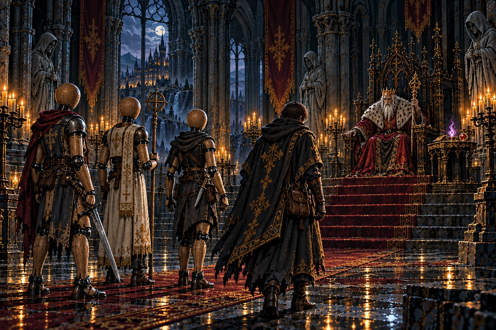
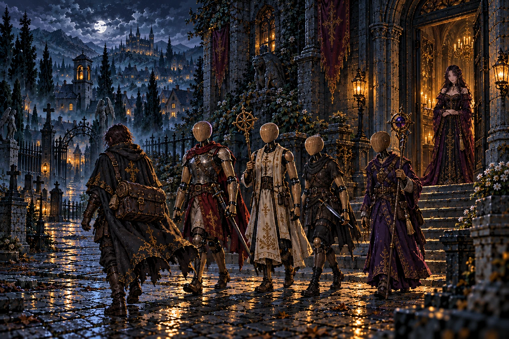
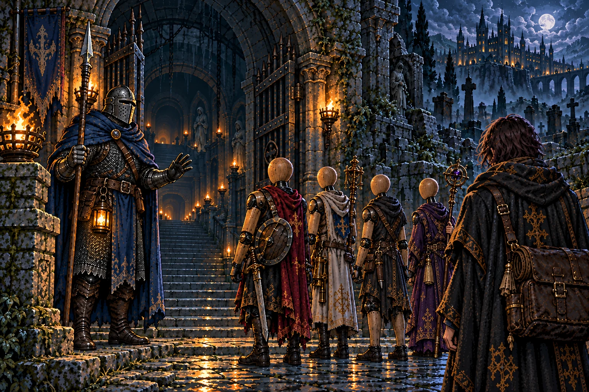
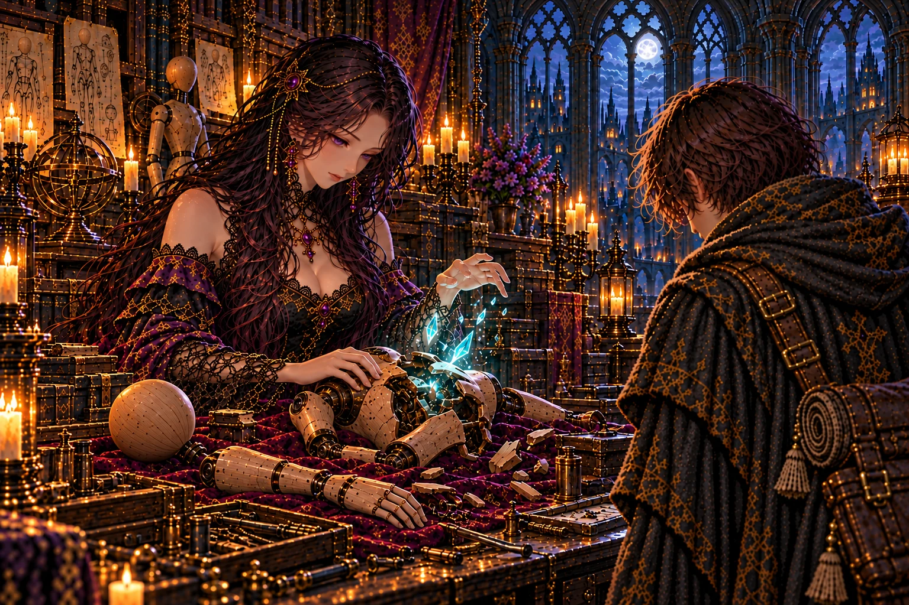

# 序章 の絵

書き出し: `node tools/storyart/review.mjs` (手で直さない)。絵は出荷する WebP、まだ無ければ原画。
ゲームで小さく出た時の見え方 (384×256): [chapter0-small.jpg](chapter0-small.jpg)

## opening「師のいない街へ」 ── 出荷済み

**ストーリー一覧の本文**

> ロアダルへ向かう道で、弟子は何度も腰の空いた場所に手をやった。そこにはいつも、師の荷から預かった小さな灯があった。今は何もない。
>
> 操霊師オルドが迷宮へ降りてから、一年。便りは途絶えていたが、ある日、師の字で短い手紙が届いた。ロアダルへ来て、館の灯を守れという。
>
> 街の屋根を越えて、墓所の門が見えた。死者の魂を宿す器なら、その向こうへ進める。教わった技を使う理由を、弟子は初めて自分で選ぼうとしていた。
>
> 師が戻らなかった道を歩く。足跡を拾い、声を探し、今度こそ一緒に地上へ帰るために。

## arrival「玉座から託された三つの魂」 ── 出荷済み (任意の修正あり)

**ストーリー一覧の本文**

> 玉座の間は、外の街よりも静かだった。弟子が名を告げると、王は顔ではなく、その手を見た。オルドから何を受け継いだのか、そこに答えを探すように。
>
> 差し出された三つの魂は、それぞれ違う色で揺れた。刃を取る者、祈る者、闇を読む者。まだ名前も器もない、小さな光だった。
>
> 王が望んだのは、まず三体の人業を目覚めさせること。迷宮へ進む許しは、そのあとに与えられる。師の留守を預かる館なら、器を仕立てられるという。
>
> 弟子は光を抱えて玉座を離れた。王が師を思う時の長い沈黙を、問いただす言葉はまだ持っていなかった。

**修正 (任意)**

- 授かる三つの魂の色を職業の色に: 戦士 = 赤、僧侶 = 金、盗賊 = 緑 (紫は後で授かる魔導士の色なので外す)

## irene_meeting「イレーヌとの出会い」 ── 出荷済み

**ストーリー一覧の本文**

> 館の扉を押すと、木の匂いとろうの温かさが流れてきた。奥には人の形をした器が並び、その間を黒い髪の女が歩いてくる。紫の衣の裾が、床を静かに滑った。
>
> イレーヌは弟子の名を聞く前に、誰が来たのかを知っていた。師がいつか話した顔なのか、それとも師に教わった立ち方なのか。彼女は確かめず、館へ迎え入れた。
>
> 言葉は丁寧で、少し距離があった。それでも扉はすぐに閉じられず、旅の荷を置く場所と、濡れた外套を掛ける場所が用意された。
>
> 主の帰らない家で、待つことをやめなかった人。その日の弟子にとって、イレーヌはまだ、それ以上でも以下でもなかった。

## irene_lamp「一年を越えた灯」 ── 出荷済み (任意の修正あり)

**ストーリー一覧の本文**

> イレーヌが案内したのは、館のいちばん奥にある燭台だった。細い火が、誰も座っていない椅子を照らしている。
>
> それは師の魂に結ばれた灯だという。芯が短くなれば整え、ろうが減れば足す。師が姿を消したあとも、彼女は毎日その仕事を続けていた。
>
> 灯は師の居場所を教えてくれない。声も届けない。ただ、まだ消えていないという事実だけが、この館と迷宮の奥をつないでいた。
>
> 弟子は火に手を近づけた。探しに行く者と、帰る場所を守る者。二人の仕事が、同じ小さな明かりから始まった。

**修正 (任意)**

- 弟子を燭台の近くに。本文「弟子は火に手を近づけた」

## first_vessel「最初の名前」 ── 出荷済み

**ストーリー一覧の本文**

> 台に寝かされた器には、まだ目の光がなかった。イレーヌが継ぎ目を確かめる間、弟子は宿す魂を両手で包んで待った。
>
> 魂が胸へ沈むと、木の指が一本ずつ動いた。教えられた手順は覚えていた。それでも、こちらを見返す目が開いた瞬間、弟子は息を止めた。
>
> 名を与える声は、思ったより小さかった。生まれた人業は聞き逃さず、呼ばれた名に顔を上げる。イレーヌはその様子を見届けてから、台の留め具を外した。
>
> 器を仕立てることと、誰かを旅へ連れていくことは同じではない。師の教えは、その日から手の中に重さを持った。

## three「三体と歩く謁見の道」 ── 出荷済み

**ストーリー一覧の本文**

> 三体の人業が、石の廊下に違う足音を響かせた。弟子は時々振り返った。全員が付いてきていることを確かめる癖が、もう身についていた。
>
> 王の前で隊を並べると、命じられた数は確かにそろっていた。だが王が新たに渡したのは、魔導士の魂と、もう一体を迎えるための赤い魂だった。
>
> 迷宮の闇へ入るには、刃と祈りだけでは足りない。弟子は四つ目の光を受け取り、また館へ向かった。今度は、どこで誰が待っているかを知っている。

## departure「四つの足音、ひとつの行き先」 ── 出荷済み

**ストーリー一覧の本文**

> 四体目が目を覚ますと、館の床に隊の影がそろった。弟子は前に立つ者と後ろに立つ者を決め、まだ新しい留め具を確かめた。
>
> 王は支度のための金貨を渡し、地下墓地への道を明かした。そこは遠い戦場ではない。ロアダルで暮らした人々が眠る、街の足元だった。
>
> 帰りを待つイレーヌへ、弟子は短く頭を下げた。大げさな約束は口にしなかった。四つの足音を、そのまま館へ戻すつもりだった。

## first_descent「門をくぐる前に」 ── 出荷済み (任意の修正あり)

**ストーリー一覧の本文**

> 門衛は、隊の刃よりも人業の目を確かめた。魂と器の結びつきは、迷宮へ入るたびに揺らぐのだという。丈夫に見える体にも、休む時間がいる。
>
> 弟子は一人ずつ顔を見た。館で目覚めたばかりの光が、暗い入口を前にしてもこちらを向いている。命令を待つその姿に、師の背中を思い出した。
>
> 門の内側から冷たい空気が流れた。誰をどこに立たせるか、どこまで進むか、いつ帰るか。教わった技の先にある判断は、もう自分のものだった。

**修正 (任意)**

- 四体が弟子の方を向く。本文「暗い入口を前にしてもこちらを向いている」。門の奥の石段は下りに

## irene_repair「砕けても、名は消えない」 ── 出荷済み・修正待ち

**ストーリー一覧の本文**

> 動かなくなった仲間を前に、弟子は名を呼ぶことしかできなかった。イレーヌは器を受け取り、傷んだ場所と魂の状態を確かめた。
>
> 宿で休ませるだけでは戻らない。器の内で砕けた魂を、館で繕う必要がある。迷宮に残った器なら、連れ帰られるのを待たなければならない。
>
> 直せると分かった安堵は、失った時の重さを消さなかった。弟子は次の隊列を考え直した。仕立てた日に付けた名を、ただ何度でも呼べばよいわけではない。

**修正 A-1**

- 直す: 作業台の外れた人業の頭と、棚の人業に目鼻が彫られている → 人業の頭は何も彫られていない丸い木 (`src/story.js` の館の語り「人業の頭は、もとは何も彫られていない、丸い木なのです」)。
- 保つもの: 砕けた魂の結晶、イレーヌ、弟子。

