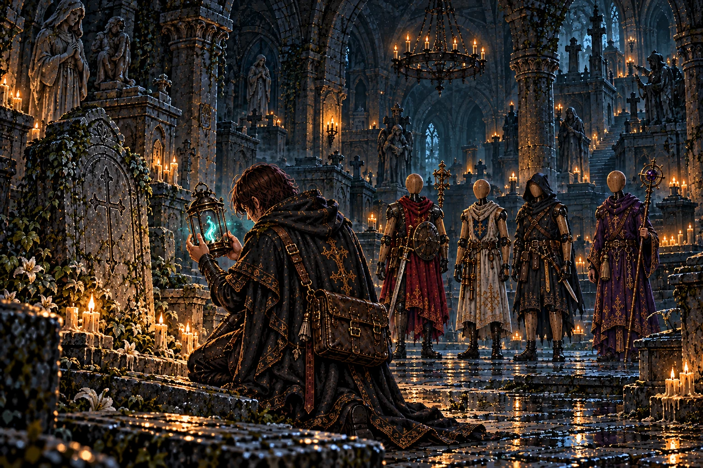
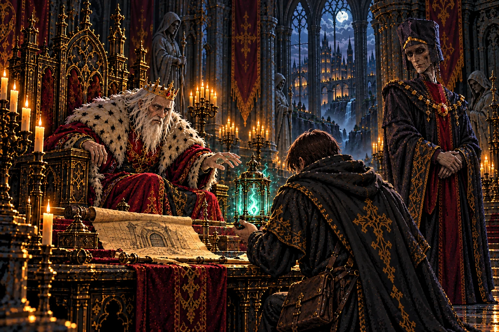
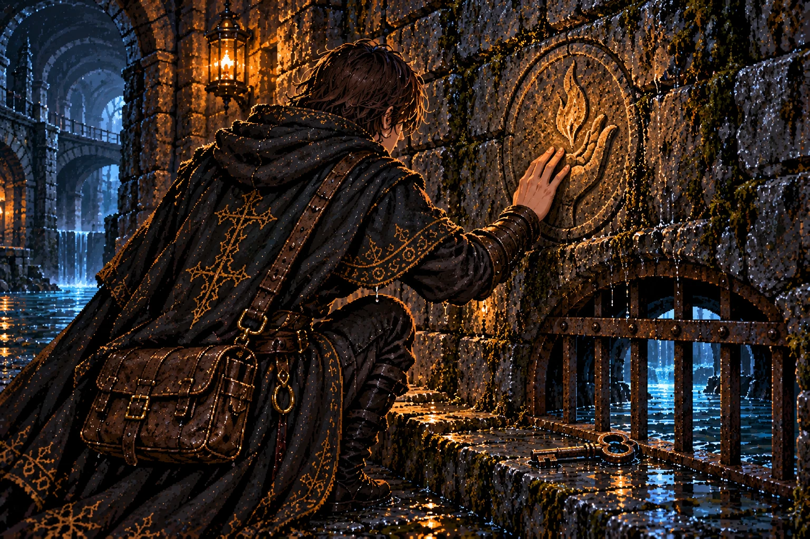
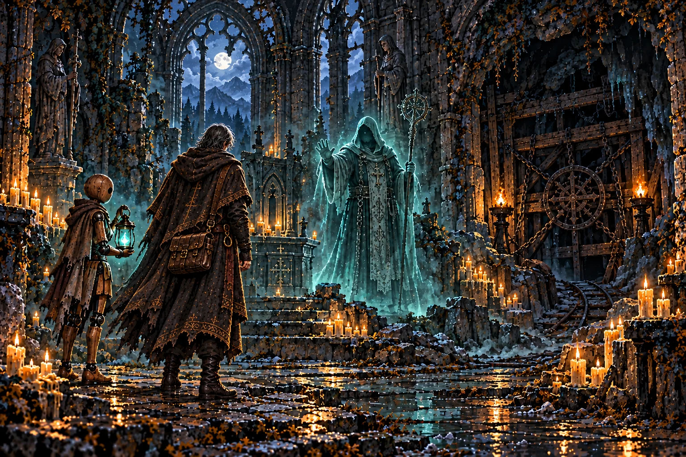
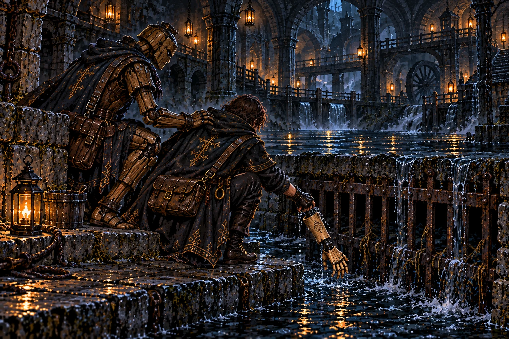
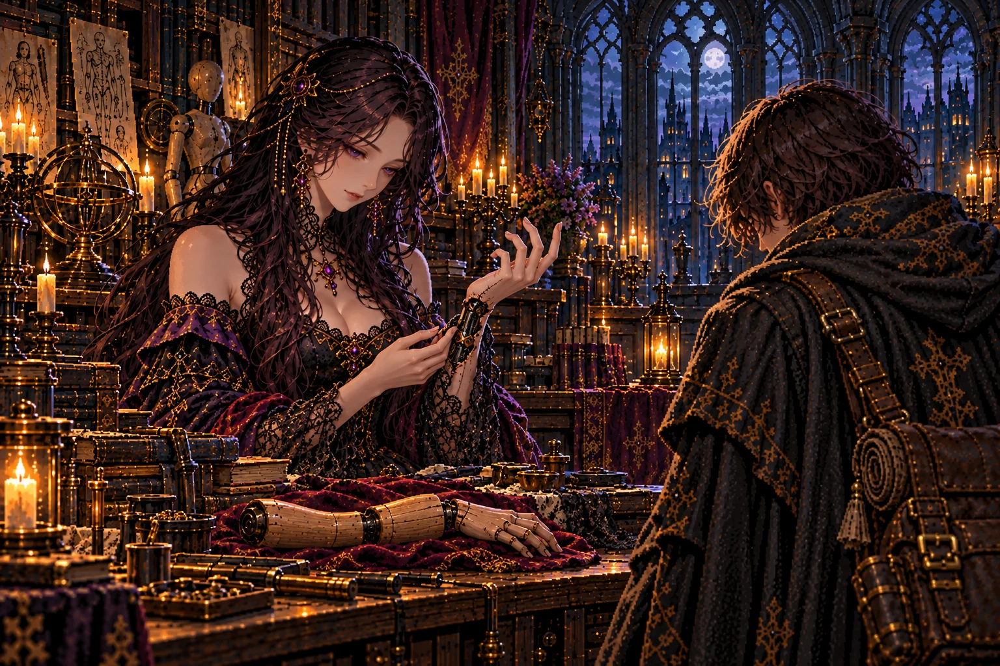
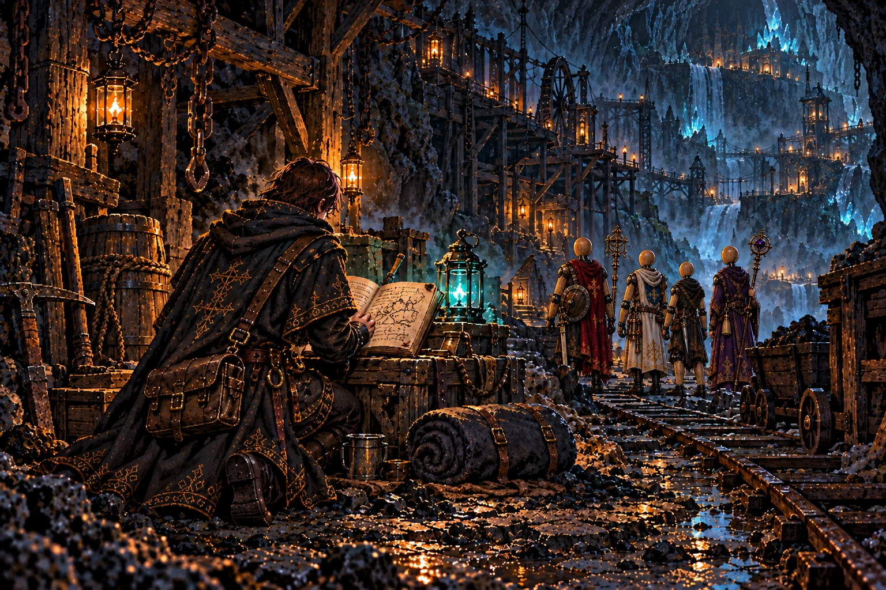
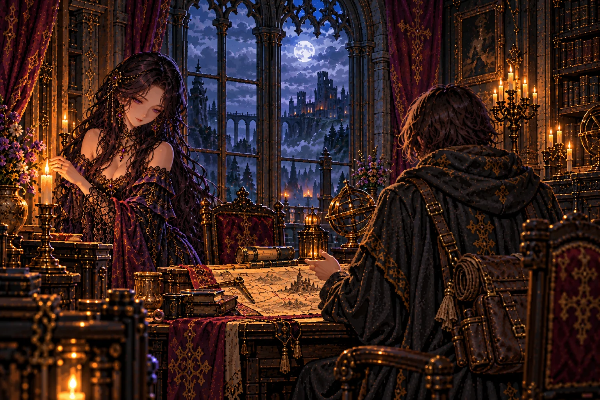
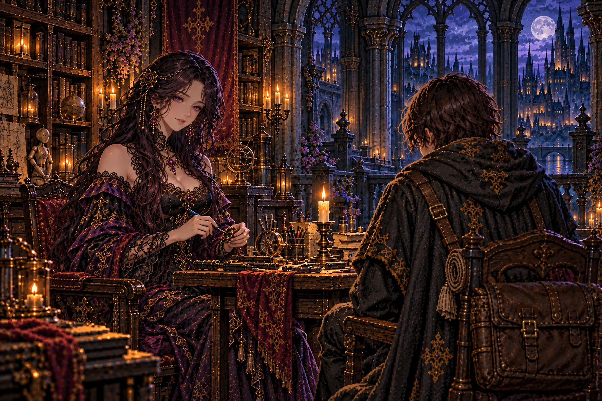

# 第1章「師の灯」 の絵

書き出し: `node tools/storyart/review.mjs` (手で直さない)。絵は出荷する WebP、まだ無ければ原画。
ゲームで小さく出た時の見え方 (384×256): [chapter1-small.jpg](chapter1-small.jpg)

## w01_lantern「墓石の上の青い火」 ── 出荷済み (任意の修正あり)

**ストーリー一覧の本文**

> 並ぶ墓の中に、一つだけ、見覚えのある金具が光っていた。弟子は隊を止め、墓石の上のランタンを両手で拾った。師が旅のたびに提げていたものだった。
>
> 火の消えたガラスの奥に、魂の光が残っている。底に刻まれた文字は、地下を巡る水の行方へ注意を向けていた。ここが師の旅の終わりではない。
>
> 弟子はランタンを荷に納めた。持ち主のいない道具を見つけた悲しさよりも、同じ道を歩いているという確かさが、今は強かった。

**ゲーム内 (師の手がかり STORY_CELLS.w01_lantern)**

> 崩れた墓石の上に、真ちゅうのランタンが置かれていた。
>
> 師オルドが、いつも腰に提げていたものだ。
>
> 火は消えている──だがガラスの内側で、青白い魂火がひとつ、かすかに揺れている。
>
> 底の金具に、爪で刻んだ文字があった。
>
> ──『水は下へ流れる。答えは、さらに下に』

**修正 (任意)**

- 墓石を崩れたものに、ランタンを真ちゅうらしく

## report_w01「閉ざされた回廊への許し」 ── 出荷済み (任意の修正あり)

**ストーリー一覧の本文**

> 王は差し出されたランタンを、急いで受け取らなかった。青い光を見つめてから、ようやく手を伸ばす。古い知人の癖を思い出したような顔だった。
>
> 墓地の奥から続く回廊は、長く閉じられた場所だった。脇に控えた宰相は、その封を解くことに言葉を挟んだ。王は聞き終える前に、道を開くと決めた。
>
> 師の足跡は、ただ地下へ続いているのではない。誰かが閉じた場所を、順に越えている。弟子は許しを受け、ランタンを抱えて王宮を出た。

**ゲーム内 (王への報告 REPORTS.w01)**

> 「オルドのランタンか。…見せてみよ。」
>
> 「魂火がまだ揺れておる。あの男は──少なくとも、その魂はまだ還っておらぬ。」
>
> 「『水は下へ』か。墓地の奥の回廊は、地下の水脈と繋がっていると聞く。」
>
> 宰相「陛下、回廊は先代の折に閉ざした区画にございます。」
>
> 「構わぬ。開けてやれ。」

**修正 (任意)**

- 王に差し出すランタンを `w01_lantern.png` と同じ形に

## w02_sigil「水音の向こうへ」 ── 出荷済み・修正待ち

**ストーリー一覧の本文**

> 壁に残る手の印を見つけた時、弟子は自分の指でその形をなぞった。師が仕事の終わりに刻む印。その下の格子の錠には、鍵が挿したままになっていた。
>
> 隙間から上がる湿った風に、地上の匂いはない。取水口へ通じる道だと分かったが、師の短い書きつけは、その名をイレーヌに知らせないよう求めていた。
>
> なぜ館で待つ人を遠ざけたのか。答えを急いで決めることはできなかった。弟子は鍵を取った。その先へ進む時も、引き返す時も、自分で選べるように。

**ゲーム内 (師の手がかり STORY_CELLS.w02_sigil)**

> 回廊の壁に、見覚えのある印が刻まれていた──灯を掌に載せた手。
>
> 師が仕事の跡に残す印だ。刻み目はまだ新しい。
>
> 印の下には錆びた鉄格子。その向こうから、湿った風と水の音が吹き上げてくる。
>
> 格子の錠には鍵が挿したままになっていた。札に一言。
>
> ──『取水口。イレーヌには言うな』
>
> ── 新たな迷宮「黒水の取水口」が地図に記された。
>
> 水音の奥には、回廊よりも深い闇がある。取水口は推奨Lv18〜21。まずは回廊を抜け、修道院で師の足跡を追おう。

**修正 A-3**

- 直す: 本文は「格子の錠には鍵が挿したままになっていた。札に一言」。いまの絵は錠も札も無く、鍵が縁石に置いてある → 鉄格子に錆びた錠前を付け、鍵を挿したままにし、鍵に小さな紙の札を結ぶ。
- 保つもの: 壁の一門の印、その下の鉄格子と水路。

## report_w02「祈りの終わらない場所」 ── 出荷済み (任意の修正あり)

**ストーリー一覧の本文**

> 師の印の話を聞いた王は、次に修道院長の名を挙げた。回廊の果てで祈り続ける者なら、そこを通った人の姿を覚えているという。
>
> 墓地の奥に回廊があり、その果てに修道院がある。地図の線は少しずつ増えたが、師が何を探したのかは、まだ空白だった。
>
> 弟子は今すぐ答えを求める代わりに、次の足跡を追うことにした。師を見た者に会う。生きた人でなくても、その魂が残っているのなら。

**ゲーム内 (王への報告 REPORTS.w02)**

> 「回廊を抜けたか。…オルドの印を見たそうだな。」
>
> 「取水口の鍵、か。あの男は昔から、黙って一人で先へ行く。」
>
> 「回廊の果てには、骸の修道院がある。死者を弔い続けた修道士どもの成れの果てよ。」
>
> 「修道院長は、通る者をすべて見ておる。…オルドの姿も、見たはずだ。」

**修正 (任意)**

- 窓の外の地上の修道院の廃墟を消す (修道院は地下)

## mem_w03「止められても進んだ人」 ── 出荷済み・修正待ち

**ストーリー一覧の本文**

> 修道院長を鎮めたあと、弟子の目に、自分が見たことのない祭壇が映った。そこに立っていたのは、一年前の師だった。
>
> 坑の底へ進むことを止められても、師は引き返さなかった。死者が帰れない理由を断つために、封じられた道の所在を求めていた。傍らには、人業が灯を抱えて立っている。
>
> 記憶が薄れた時、祭壇の前には弟子の隊だけが残った。師の目的を初めて知った。それは誰か一人を助ける仕事よりも、ずっと広く、危ういものだった。

**ゲーム内 (主の記憶 BOSS_MEMORIES.w03)**

> 主が崩れ落ちると、骸から淡い魂がほどけ、記憶の断片が流れ込んできた──
>
> ……一年前。旅装の男が、祭壇の前に立った。
>
> ──『坑口はどこだ』
>
> わしは止めた。坑の底には、掘り当ててはならぬものがある。先代の王が自ら封じたのだ、と。
>
> 男は笑った。──『だから行くのだ。あれを断たねば、魂はいつまでも還れない』
>
> 男の後ろには木の人業がひとり、灯を抱いて従っていた……

**修正 A-5**

- 直す (1): 師に従う人業が、師のランタンと同じ形のランタンを提げている → 師はランタンを地下墓地に残した後なので、別の灯にする。本文は「灯を抱いて従っていた」 → 両腕で小さな真鍮の皿灯 (炎は温かい橙) を胸に抱える。
- 直す (2): その人業はセラ (第二章で師と一緒だったと分かる)。正典のセラの姿にする (本物の長い黒髪・木の顔・額の印・黒鉄の継ぎ目。この時はまだ壊れていない。白い布の衣)。基準 `docs/art/sera/sera-r1-final.png`。
- 直す (3): 師を正典のオルドに (弟子と同じ外套・鞄にしない。ランタンを持たない。腰に刃)。
- 直す (4): 祭壇のすぐ脇の鎖を巻いた坑口の扉・トロッコの線路を消す (坑口は別の迷宮)。
- 保つもの: 修道院の祭壇、止める修道院長、去っていく二人の構図。

## report_w03「封じた者の沈黙」 ── 出荷済み・修正待ち

**ストーリー一覧の本文**

> 修道院長の記憶を伝えると、王の目が宰相から離れた。古い坑口は王家が封じた場所だという。師は、その封の向こうを探していた。
>
> 何を恐れて閉じたのか。王は詳しく語らず、宰相も問いを受けなかった。報告を聞く二人の間に、弟子の知らない過去があった。
>
> 迷宮に残る記憶の方が、地上の言葉よりも率直なのかもしれない。弟子はその考えを口にせず、次の支度へ戻った。

**ゲーム内 (王への報告 REPORTS.w03)**

> 「修道院長を鎮めたか。…その顔、何か見たな。」
>
> 「坑口、か。……あの坑を封じたのは、余だ。オルドめ、あれを開ける気でおったか。」
>
> 「…もっとも、そなたはもう通行証を持っておったな。あの坑が、そなたの人業に歩ける所かは知らぬが。」
>
> 宰相が、王の横顔を盗み見た。

**修正 A-2**

- 直す: 宰相が別人 (茶髪の壮年の顔・司教冠) → 正典のモルデン。基準画像 `art/story-review/prologue/morden-at-throne.png` と `chapter1/report_w01.png` を渡す。
- 保つもの: 王が目をそらし、宰相が横目で王を盗み見る構図。

## w04_arm「黒い流れが返したもの」 ── 出荷済み・修正待ち

**ストーリー一覧の本文**

> 格子に引っかかっていた腕は、冷たい水の中でも指の形を失っていなかった。弟子は流れに足を取られないよう、隊に支えられて引き上げた。
>
> 黒鉄の継ぎ目の内側に、師の印がある。人業の器だ。それも、師が自分の手で仕立てたものだった。
>
> 誰の腕なのかも、どこで失われたのかも分からない。弟子は布に包み、館へ持ち帰ることにした。あの家なら、この小さな刻み目を知る人がいる。

**ゲーム内 (師の手がかり STORY_CELLS.w04_arm)**

> 取水口の格子に、木の腕が一本、引っかかっていた。
>
> 人業の腕だ。黒鉄の継ぎ目、指の一本一本まで彫り込まれた、見事な仕事。
>
> 手首の内側に、小さな刻印──灯を掌に載せた手。師の印。
>
> ……師の作った人業が、黒い水に流されてきたのだ。
>
> 館の主に見せなければならない。そんな気がした。

**修正 A-4**

- 直す (1): 弟子を支える人業が、箱形の兜のような頭に弟子と同じ外套を着ている → 隊の4体の一人 (赤い外套の戦士) に。頭は何も彫られていない丸い木。
- 直す (2): 腕の印が前腕の外側に大きく渦巻きの手 → **手首の内側に小さく**、掌に炎を載せた手 (`w02_sigil.png` の印)。
- 保つもの: 黒い流れ・格子・腕を引き上げる弟子。

## irene_reveal「レースの下の継ぎ目」 ── 出荷済み

**ストーリー一覧の本文**

> 腕を見せると、イレーヌの手が止まった。返ってきた名はセラ。師が彼女より先に作り、ともに迷宮へ連れていった人業だった。
>
> イレーヌは袖口の黒いレースをめくった。白い手首に、腕と同じ黒鉄の継ぎ目が巻きついている。館を預かり、器を作り、灯を守る彼女自身も、師の作った人業だった。
>
> 弟子は言葉を探したが、彼女は驚きへの返事を求めなかった。セラが流された場所よりも、師は深く進んでいるかもしれない。その人を見つけてほしいと願った。
>
> 人業という名は、旅の仲間だけを指すものではなくなった。帰る場所で待つ人の手首にも、同じ継ぎ目があった。

**ゲーム内 (館の語り IRENE_BEATS.irene_reveal)**

> イレーヌ「……その腕を、どこで見つけたのですか。」
>
> 館の主は腕を受け取ると、長いあいだ黙って、継ぎ目を指でなぞっていた。
>
> イレーヌ「この子は、セラ。オルド様が、わたしの前に作った人業です。」
>
> イレーヌ「あの方と一緒に、迷宮へ降りたはずの子です。」
>
> 彼女は袖口の黒いレースをめくった。白い手首に、黒鉄の継ぎ目が光っていた。
>
> イレーヌ「……隠すつもりはありませんでした。わたしも、人業です。」
>
> イレーヌ「オルド様に作られ、オルド様の灯を守るために、ここにいます。」
>
> イレーヌ「セラが流されてきたのなら、あの方は水よりも深い所へ行ったのでしょう。……お願いします。見つけてください。」

## report_w04「答えを飲み込んだ王」 ── 出荷済み

**ストーリー一覧の本文**

> 取水口で見た流れを伝えると、王はその先が王都の中心へ向かうことを認めた。水は地下を巡り、遠い場所同士を結んでいる。
>
> 何を運ぶのかという問いに、王の答えは続かなかった。宰相が名を呼ぶと、話は褒美へ移った。弟子の手には金貨が残り、問いは宙に浮いたままだった。
>
> 地図に書けることと、口にしてよいことは違うらしい。その境目を、師はすでに越えていたのだろうか。

**ゲーム内 (王への報告 REPORTS.w04)**

> 「取水口の底まで降りたか。黒い水がどこへ流れるか、見たか。」
>
> 「…王都の中心へ、地の底をくぐって流れ込んでおる。何を運んでいるのかは──まあ、よい。」
>
> 宰相「陛下。」
>
> 「分かっておる。…褒美だ、持ってゆけ。」

## minePass「三つの宝と古い封」 ── 出荷済み

**ストーリー一覧の本文**

> 宝物庫へ納めた三種類の品は、迷宮を歩いた確かな証になった。王はその働きに、古い坑口の通行証を渡した。
>
> 封を越える許しは、安全を約束しなかった。弟子の隊がまだ届かない闇かもしれないと、王は警告した。師の名が、そのあとに小さく添えられた。
>
> 弟子は証をしまい、隊の支度を思い浮かべた。道が開いたことと、今すぐ進めることは違う。師を追うためにも、仲間を使い切るわけにはいかなかった。

**ゲーム内 (坑口の通行証 MINE_PASS)**

> 「三つも宝を納めたか。王家への尽力、しかと見た。」
>
> 「褒美に、これを授ける。先代の王が封じた坑口の通行証だ。」
>
> 「ただし言うておく。あの坑は、そなたの人業がいまだ歩ける場所ではないかもしれぬ。」
>
> 「死にに行くのも、そなたの自由だ。…オルドもそうであった。」
>
> ── 新たな迷宮「鎖の垂れる坑口」が地図に記された。

## mem_w05「師が残した帰り道」 ── 出荷済み (任意の修正あり)

**ストーリー一覧の本文**

> 坑道の主が倒れた先に、焚き火の跡と畳まれた寝袋があった。師はここで休み、それからまた下へ進んだのだ。弟子は革の手記を開いた。
>
> 百の迷宮から魂を吸い上げ、王都へ送る魂脈。師が追っていたものに、ようやく名が付いた。イレーヌへ灯を守るよう頼む文字のあとには、弟子への言葉もあった。
>
> 危険だから来るなという思いと、それでも追ってくるだろうという思い。両方を読み取って、弟子は手記を閉じた。
>
> 師はすべてを語らなかったが、足跡は残していた。次に向かう場所は、国境で見捨てられた砦の地下だった。

**ゲーム内 (主の記憶 BOSS_MEMORIES.w05)**

> 坑道の主が砕けた奥に、古い野営の跡があった。
>
> 冷えた焚き火の輪。畳まれた寝袋。そして、革表紙の手記。
>
> ──『イレーヌへ。灯を絶やすな。私は「魂脈」の根を見つけた』
>
> ──『百の迷宮から魂を吸い上げ、王都へ運ぶ魂脈だ。これを断つまで、私は戻れない』
>
> ──『弟子よ。お前がこれを読んでいるなら──来るな。……いや、お前は来るのだろうな』
>
> ──『坑の底の、さらに下。国境の捨て砦の地下へ』
>
> 最後の頁には師の印がひとつ。インクはまだ、乾ききっていないように見えた。

**修正 (任意)**

- 冷えた焚き火の輪を足す。手記の脇のランタンを消す (師の物に見える)

## report_w05「捨て砦の門が開く」 ── 出荷済み

**ストーリー一覧の本文**

> 手記を読み終えた王は、長く火を見つめた。魂脈という言葉を、初めて聞いた顔ではなかった。宰相の言葉を退け、砦の封を解くと告げた。
>
> 百年前に王都が見捨てた国境の砦。師はそこへ向かっていた。王の語る過去は短かったが、短い言葉ほど重く玉座の間に残った。
>
> 弟子は新たな道を受け取った。師を探す旅は、王国が忘れたことを拾う旅にもなり始めていた。

**ゲーム内 (王への報告 REPORTS.w05)**

> 「坑道の主を討ったか。…オルドの手記を見つけたそうだな。見せよ。」
>
> 王は手記を読み終えると、長いあいだ玉座の燭台を見つめていた。
>
> 「『魂脈』か。…あの男は、そこまで辿り着いたか。」
>
> 宰相「陛下、この手記は──」
>
> 「下がれ、宰相。」
>
> 「…捨て砦の封を解かせよう。国境の砦だ。王都が百年前に見捨てた、な。」
>
> 「オルドの弟子よ。そなたの師は、生きておる。……少なくとも、まだ。」

## irene_fort「待つ者の願い」 ── 出荷済み

**ストーリー一覧の本文**

> 砦への道が開いたと聞いても、イレーヌは灯の手入れを止めなかった。見捨てられた守備隊の魂は、今も持ち場を離れられないという。
>
> 帰る場所を失った魂と、館を守り続ける人業。似たところがあるのだと、彼女は静かに語った。弟子には、それが同じだとは思えなかった。ここには、帰りを願う相手がいる。
>
> 師の帰りを待つ燭台は、一つのまま燃えていた。弟子は、その灯が指す足跡を探す支度を整えた。

**ゲーム内 (館の語り IRENE_BEATS.irene_fort)**

> イレーヌ「捨て砦の封が解かれたと、王宮から報せがありました。」
>
> 館の主は、燭台の灯から目を離さずに言った。
>
> イレーヌ「百年前に見捨てられた砦。死んだ守備隊の魂は、いまも還れずにいると聞きます。」
>
> イレーヌ「器に宿りそこねた魂は、行き場を失うと、持ち場にしがみつくのです。……人業と、同じですね。」
>
> イレーヌ「坑の底の、さらに下。あの方の足取りは、きっとあの砦の地下にあるはずです。」
>
> イレーヌ「セラの残りも、どこかにあるはずです。……気をつけてください。」

## ch1_end「灯を置いて、先へ」 ── 出荷済み (任意の修正あり)

**ストーリー一覧の本文**

> 墓地から回廊、修道院、そして坑へ。散らばっていた足跡は、師が何を求めて進んだのかを示す一本の道になった。
>
> 灯を守る仕事はイレーヌが続ける。弟子はその明かりを背に、砦へ向かう。二人は同じ場所には立てないが、同じ人の帰りを願っていた。
>
> 国境の向こうに雲が重なっている。まだ姿の見えない師へ近づくために、今度は百年前の夜を歩かなければならなかった。

**ゲーム内 (章の結び CHAPTER_END[1])**

> 館の燭台の灯は、今夜も消えずに揺れている。
>
> 師は生きている。王都へ魂を運ぶ「魂脈」の根を追って、捨て砦の地下へ。
>
> ── 物語は第二章「捨て砦」へ続く。

**修正 (任意)**

- 人業を大人の背丈、頭は何も彫られていない丸い木

## irene_familiar「名で呼べる距離」 ── 出荷済み

**ストーリー一覧の本文**

> 館を訪れるたびに、イレーヌの言葉は少しずつ短くなった。弟子が何を探し、何を抱えて戻るのかを、最初から説明する必要がなくなっていた。
>
> ある日、彼女は堅い呼び方をやめてよいと告げた。弟子が名を呼ぶと、道具を並べる手が一瞬だけ止まった。返ってきた声は、いつもより近かった。
>
> 師の弟子と、師の留守を預かる人。二人はその役目のままで、少しずつ互いの帰りと訪れを待つようになった。

