# 第2章「捨て砦」 の絵

書き出し: `node tools/storyart/review.mjs` (手で直さない)。絵は出荷する WebP、まだ無ければ原画。
ゲームで小さく出た時の見え方 (384×256): [chapter2-small.jpg](chapter2-small.jpg)

## w06_roll「交代のない当直」 ── 出荷済み (任意の修正あり)

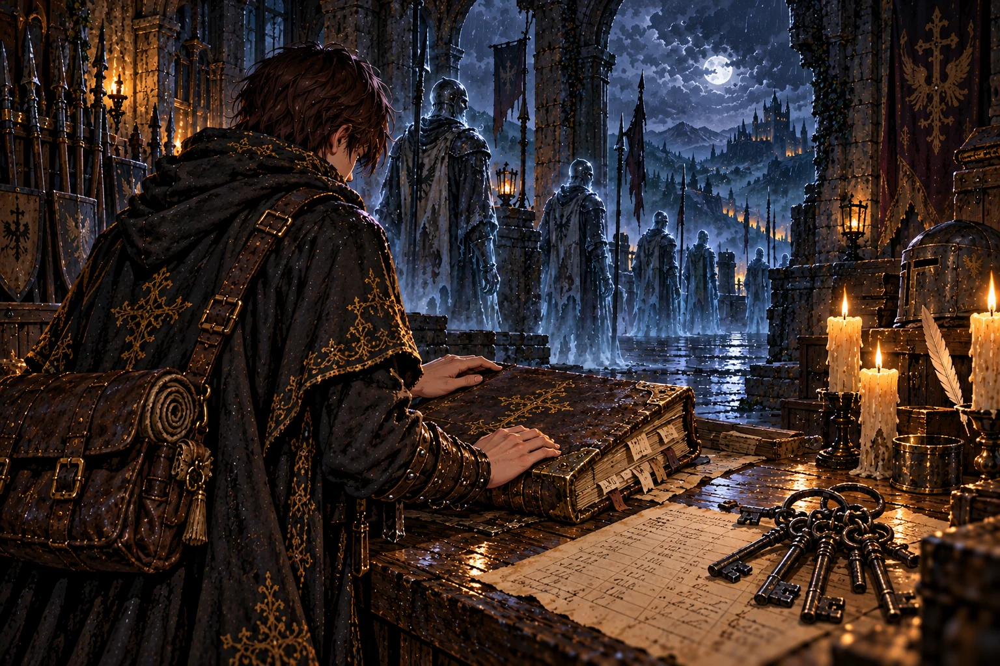

**ストーリー一覧の本文**

> 詰所の当直簿は、百年前の頁で止まっていた。援軍を待つ守備隊に届いたのは、持ち場を離れるなという命令だけだった。
>
> 古い記録の下に、師の筆跡があった。セラとともに通ったこと、地下牢の鍵を借りたこと。そして、帰れなかった兵へ敬意を向けた短い言葉。
>
> 弟子は鍵束を取る前に、帳面を静かに閉じた。師は道具だけを借りたのではない。この場所を守っていた者たちを、見ないふりせず通ったのだ。

**ゲーム内 (師の手がかり STORY_CELLS.w06_roll)**

> 詰所の机に、分厚い当直簿が開いたままになっていた。
>
> 最後の頁の日付は、百年前。乱れた筆で──
>
> ──『援軍来たらず。王都よりの返書、ただ一行。「持ち場を守れ」』
>
> その下に、まだ新しい墨の一行が書き足されていた。見慣れた、癖のある字。
>
> ──『操霊師オルド、人業セラを伴い通過。地下牢の鍵を借りる。守備隊の諸君に、敬礼を』
>
> 当直簿をとじた紐には、錆びた鍵束が結ばれたままだった。
>
> ── 新たな迷宮「捨て砦の地下牢」が地図に記された。

**修正 (任意)**

- 鍵束を当直簿をとじた紐に結ぶ。窓の外の灯る城を消す

## report_w06「守れと命じ、迎えなかった」 ── 出荷済み

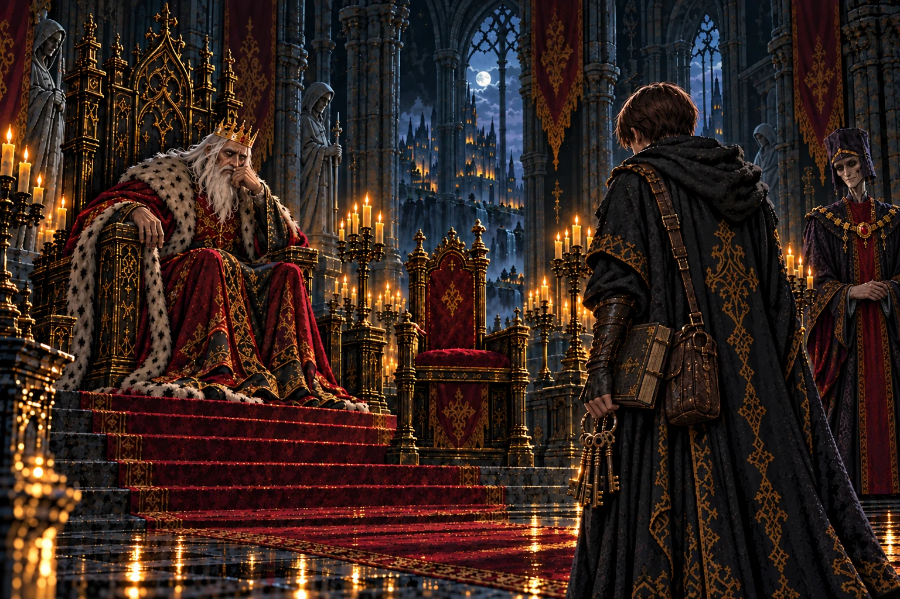

**ストーリー一覧の本文**

> 亡兵の隊列を報告すると、王は援軍を送らなかった過去を語った。国を守るためだったという説明が、玉座の脇から添えられた。
>
> だが、守備隊が守り続けたものは何だったのか。地上に戻ることさえできない魂を見たあとでは、理由を聞くだけで納得はできなかった。
>
> 王は地下牢の話になると、知らないことにしていると認めた。知らないことと、知らないままでいることの違いが、その日ほどはっきりしたことはなかった。

**ゲーム内 (王への報告 REPORTS.w06)**

> 「捨て砦の外郭を抜けたか。…亡兵どもは、まだ持ち場を守っておったか。」
>
> 「あの砦は、先代の王が見捨てた。北の軍勢に囲まれた折、援軍を送らず、王都の門を閉ざした。」
>
> 「『持ち場を守れ』──それが、守備隊が受け取った最後の言葉だ。」
>
> 宰相「陛下、それは国を守るための──」
>
> 「分かっておる。…余も、そう教えられて育った。」
>
> 「オルドは地下牢の鍵を借りていったか。あの牢に何があるか、余は知らぬ。…知らぬことにしておる。」
>
> 「正門の大手門は、いまも雷雨の中だという。行くなら、火を携えてゆけ。」

## w07_names「消されなかった名」 ── 出荷済み

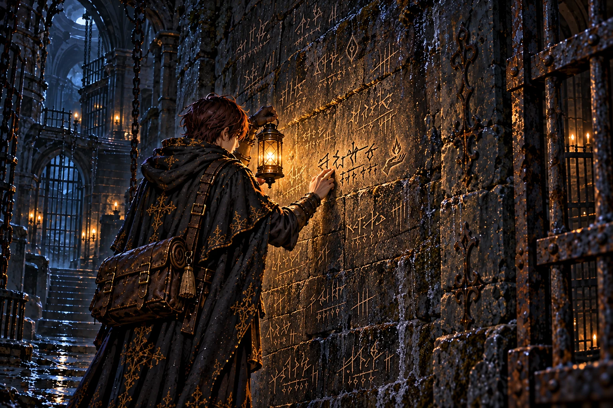

**ストーリー一覧の本文**

> 牢壁には、いくつもの名が爪で刻まれていた。誰もが王に仕えた操霊師だった。職を与えられた者たちが、同じ場所で閉じ込められている。
>
> ヴェルナーの名を見つけ、弟子は足を止めた。師が時々語った、そのまた師。魂脈の所在を問うことが、牢へ送られる理由になっていた。
>
> 傍らに師の印が添えられている。オルドはこの名を見つけた。弟子もまた、その前へ来た。三人の道が、冷たい壁の上で重なった。

**ゲーム内 (師の手がかり STORY_CELLS.w07_names)**

> 牢の壁一面に、爪で刻んだ名が並んでいた。
>
> 名の下には、どれも同じ肩書きが添えてある──『王の操霊師』。
>
> 古いものは読めぬほど削れ、新しいものほど深い。数えると、十を超えた。
>
> いちばん新しい名の下に、ひときわ深い刻み目。
>
> ──『ヴェルナー。魂脈のありかを問うた罪により』
>
> 師オルドが、ときおり口にした名だ。……師の、そのまた師の名。
>
> その横に、灯を掌に載せた手の印が、そっと刻み足されていた。

## w07_sera「声の残る独房」 ── 出荷済み

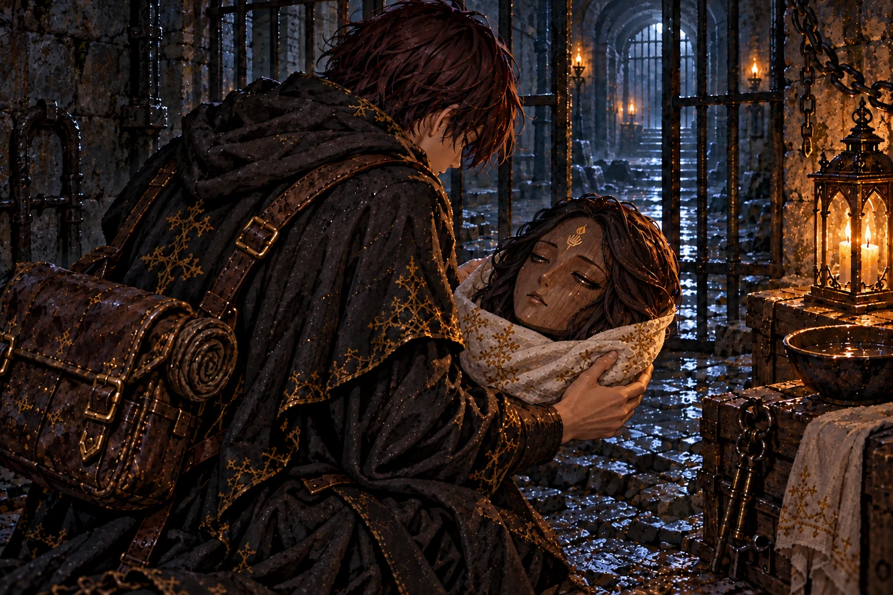

**ストーリー一覧の本文**

> 最奥の独房にあった木の頭を持ち上げると、まぶたが動いた。薄い声が師を呼び、それから弟子だと気付いた。セラだった。
>
> 言葉は途切れながら、本丸の大穴の下を示した。魂脈に呑まれ、体を分かたれ、水に運ばれたこと。その先を語る力は残っていなかった。
>
> 弟子は布を折り、傷ついた顔を包んだ。手がかりとして荷にしまうのではなく、帰る相手として抱えた。館には、この名を知る人が待っている。

**ゲーム内 (師の手がかり STORY_CELLS.w07_sera)**

> 最奥の独房に、人業の頭がひとつ、置き去りにされていた。
>
> 彫られた木の顔に、長い黒髪。額には、師の印。
>
> 拾い上げると、木のまぶたがかすかに震えた。
>
> ──『……オルド、様……?』
>
> ──『ちがう……あなたは……お弟子さま。……あの方は、本丸の大穴の、さらに下』
>
> ──『魂脈に……呑まれて……わたしは、ばらばらに……水に……』
>
> 声はそこで途切れた。魂の灯は、まだ消えていない。館へ連れて帰らなければ。

## irene_sera「眠りを守る二つの手」 ── 出荷済み

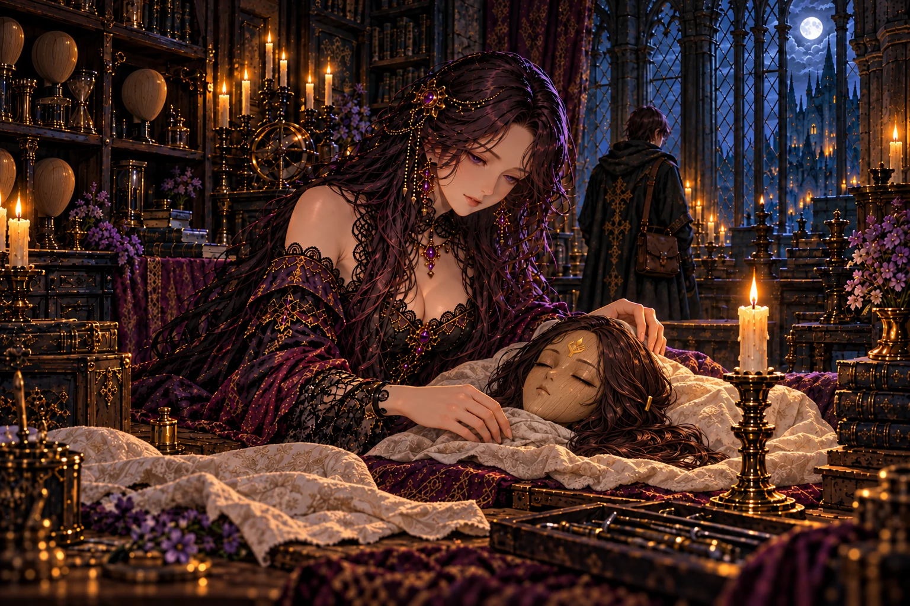

**ストーリー一覧の本文**

> イレーヌはセラの頭を受け取ると、燭台のそばに置いた。呼びかける声は、弟子を迎えた時よりも近く、柔らかかった。
>
> 新しい器を仕立てることはできる。それでも、今のセラを起こすことはできない。魂が師の灯に結ばれているために、師の帰りが必要なのだという。
>
> 弟子は、二人とも連れ帰るという願いを聞いた。セラの木のまぶたがわずかに動く。灯を守る手は、これから眠る仲間も守っていく。

**ゲーム内 (館の語り IRENE_BEATS.irene_sera)**

> イレーヌ「……セラ。」
>
> 館の主は木の頭を両手で受け取ると、燭台の灯の傍らに、そっと置いた。
>
> イレーヌ「魂が、まだ残っています。でも器がこれでは、長くは持ちません。」
>
> イレーヌ「体を仕立て直してあげたいのです。……けれど、この子の魂は、オルド様の灯と結ばれているのです。」
>
> イレーヌ「あの方が戻らないかぎり、この子は目を覚ましません。」
>
> 燭台の灯が揺れ、セラの木のまぶたが、ほんの少しだけ動いた気がした。
>
> イレーヌ「大穴の下……。お願いします。二人とも、連れて帰ってきてください。」

## report_w07「問いを罪にした王国」 ── 出荷済み

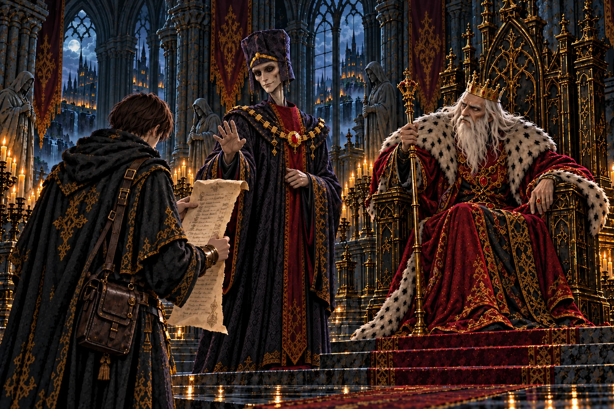

**ストーリー一覧の本文**

> 牢の名を一つずつ伝えると、王は先代が操霊師たちを牢へ送ったと語った。魂を扱う者は、隠されているものに近づいてしまうのだという。
>
> 宰相が話を止めようとした時、王はその顔を見た。先代の頃から仕えているはずの男に、歳月の跡が見えない。
>
> 弟子は、師の師を閉じ込めた牢を出てきたばかりだった。ここで耳にする言葉も、やがて壁に刻まれた名のように、誰かが残さなければ消されるのだろうか。

**ゲーム内 (王への報告 REPORTS.w07)**

> 「地下牢の底まで降りたか。…何を見た。」
>
> 「歴代の操霊師の名、か。…先代は、操霊師を十二人、あの牢に入れた。」
>
> 「操霊師は魂を扱う。扱ううちに、見てはならぬものを見る。見た者は、牢へ送られた。」
>
> 宰相「陛下、そのお話は──」
>
> 「宰相。そなたは、先代の頃から宰相であったな。」
>
> 宰相は答えず、深く頭を垂れた。白髪の一本も無い頭を。
>
> 「正門も地下牢も見たそなたになら、本丸の門を開かせよう。」

## w08_banner「空からではなく、足元から」 ── 出荷済み

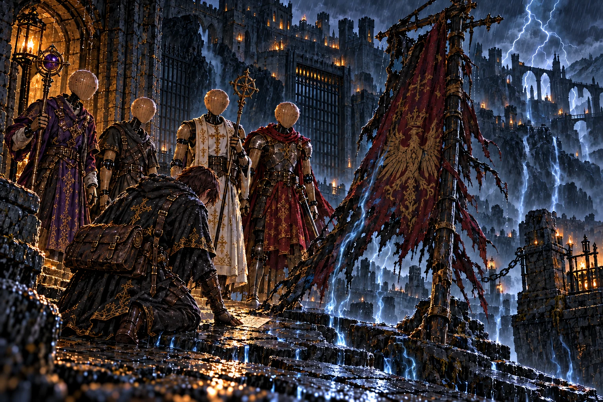

**ストーリー一覧の本文**

> 焼けた旗の裏に、師の調べた雷雨の答えが残っていた。雷はただ砦に落ちているのではない。地下へ引き寄せられている。
>
> 弟子が石畳に触れると、音の奥に脈打つものがあった。天の怒りだと呼ばれた嵐が、地の底へ魂を運ぶ仕事を続けている。
>
> 旗を支える手は、もうそこにない。それでも旗が失われなかったのは、この砦を忘れなかった者たちの魂が残っているからかもしれなかった。

**ゲーム内 (師の手がかり STORY_CELLS.w08_banner)**

> 門の内側に、焼け焦げた軍旗が突き立っていた。
>
> 百年、雷に打たれ続けた旗竿は炭のように黒い。だが旗は、燃え尽きていない。
>
> 旗の裏に、師の細い字で書きつけがあった。
>
> ──『雷は落ちるのではない。吸われるのだ。砦の真下へ』
>
> ──『この雷雨は天の怒りではない。魂脈が、砦の魂を地の底へ吸い込む音だ』
>
> 石畳に耳を当てると、雷鳴に混じって、遠い水音のような脈動が聞こえた。

## report_w08「雷鳴の答えを待つ玉座」 ── 出荷済み

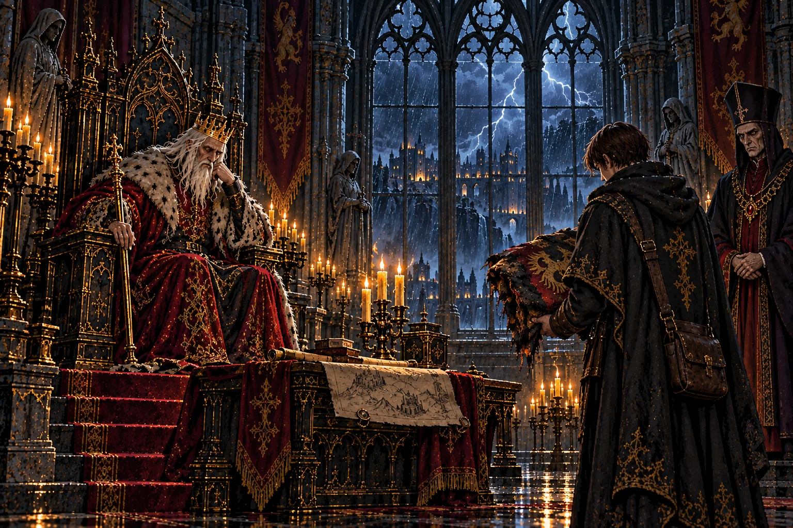

**ストーリー一覧の本文**

> 止まない雷雨の理由を伝えると、王はすぐには答えなかった。大手門の上空にあるものより、足元にあるものを確かめた師の姿を思い浮かべているようだった。
>
> 百年続いた嵐を、誰も終わらせられなかったのか。それとも、終わらせなかったのか。弟子は、その二つを分けて考え始めていた。
>
> 正門を越えた記録が残った。弟子はこれまでに集めた報告を思い返し、本丸へ進むための支度を確かめた。答えを得るための仕事は、まだ続く。

**ゲーム内 (王への報告 REPORTS.w08)**

> 「大手門を越えたか。あの雷雨の中を。」
>
> 「百年、止まぬ雷雨だ。学者どもは天のたたりと言う。」
>
> 「…天ではなく、地の底が吸っておる、か。オルドらしい物言いだ。」
>
> 王はしばらく、玉座の燭台を見つめていた。
>
> 「地下牢も正門も見たそなたになら、本丸の門を開かせよう。」

## w09_map「百の井戸」 ── 出荷済み

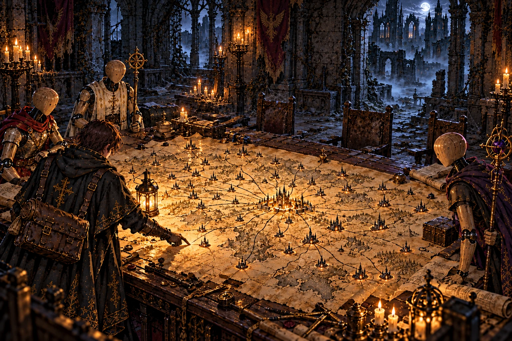

**ストーリー一覧の本文**

> 軍議の卓の地図には、迷宮の位置が印されていた。それぞれから伸びる線は、一本ずつ王都へ集まっている。
>
> 師の書き込みを読み、弟子は地図を見直した。迷宮は魂を閉じ込めるだけの場所ではない。集め、汲み上げ、送るための仕組みなのだ。
>
> これまで踏んだ地下の道が、卓の上で一つにつながった。先へ進むほど王都へ近づく。地上を離れたつもりで、王国の中心へ向かっていた。

**ゲーム内 (師の手がかり STORY_CELLS.w09_map)**

> 軍議の間の大卓に、黄ばんだ地図が広げられたままになっていた。
>
> 王国の全図。迷宮のある場所に、ひとつずつ黒い印が打たれている。
>
> 印と印は細い線で結ばれ、線はすべて、一点へ流れ込んでいた。
>
> ──王都。
>
> 地図の余白に、師の字で一行。
>
> ──『百の迷宮は檻ではない。井戸だ。汲み上げているのは、魂だ』
>
> 王都の真ん中の井戸がひとつだけ、赤い墨で囲まれていた。
>
> ── 新たな迷宮「王都の古井戸」が地図に記された (寄り道の迷宮・推奨Lv55〜58)。

## mem_w09「砦を捧げた書状」 ── 出荷済み (任意の修正あり)

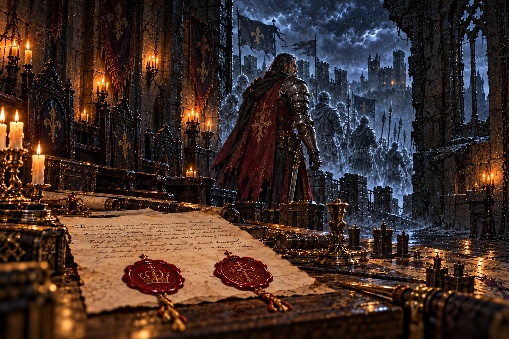

**ストーリー一覧の本文**

> 砦の主の記憶は、雷雨の夜へ弟子を連れていった。王都からの書状には、砦を捨てる命令と、守備隊に知らせないという命令が並んでいた。
>
> 王家と宰相府、二つの印が兵たちの行く末を決めた。主は部下を置いて逃げず、最後まで同じ場所に残った。誰も救われないことを知りながら。
>
> 記憶はさらに、一年前の師を映した。セラを戻そうとする師と、首を振るセラ。二人は本丸の大穴へ降りていった。
>
> 弟子は目を開けた。兵の魂を奪ったものと、師が追ったものは同じだった。書状の印を、今度は地上へ持ち帰らなければならない。

**ゲーム内 (主の記憶 BOSS_MEMORIES.w09)**

> 砦の主が崩れ落ちると、鎧の中から、百年分の魂がほどけ出した──
>
> ……雷雨の夜。王都の使者が、一通の書状を差し出した。
>
> ──『砦を捨てよ。ただし守備隊には伝えるな。彼らの魂は、砦ごと「魂脈」に捧げる』
>
> 封蝋は王家の紋。その傍らに、宰相府の印。
>
> 主は書状を握り潰し、最後まで部下と共に戦った。そして、部下と共に、魂脈に呑まれた。
>
> ……一年前。旅装の男が、本丸の床に開いた大穴を覗き込んでいた。
>
> ──『ここが根か。……いや、まだ先がある。魂脈は、もっと深い所から伸びている』
>
> ──『セラ。お前は戻れ。イレーヌに伝えてくれ。灯を、絶やすなと』
>
> 人業の少女は首を振った。そして二人は、大穴の闇へ降りていった……

**修正 (任意)**

- 書状を握りつぶした形に

## report_w09「先代という仮面」 ── 出荷済み

**ストーリー一覧の本文**

> 書状の二つの印を告げた日、玉座の脇に宰相はいなかった。王は長く黙ったあと、百年前の命令を出したのは自分だと語った。
>
> 先代の王は別人ではなかった。魂脈が運ぶ魂で生き延び、民には代替わりしたと思わせていた。一人の命のために、どれだけの帰れない魂が残ったのだろう。
>
> 師はその秘密を知り、王を斬るだけで終わらせようとはしなかった。魂を奪う仕組みそのものを断つために、地下へ向かったのだ。
>
> 弟子の前で、王は道を止めなかった。止める資格がないと認めた声には、初めて玉座の上の人間の弱さがあった。

**ゲーム内 (王への報告 REPORTS.w09)**

> 「砦の主を鎮めたか。…その顔、また何かを見たな。」
>
> 王に、書状のことを話した。王家の紋の封蝋と、宰相府の印のことを。
>
> 王は長いあいだ黙っていた。宰相の姿は、玉座の間のどこにもなかった。
>
> 「……先代の王など、おらぬ。」
>
> 「百年前に砦を捨てたのは、余だ。」
>
> 「余は百年、魂脈の運ぶ魂を受けて生きてきた。民は、王の顔が三度替わったと思うておる。」
>
> 「オルドはそれを知った。知って、なお余に仕え……そして、魂脈を断ちに行った。」
>
> 「余を斬れば済む話だと、あの男は一度も言わなんだ。」
>
> 「軍議の卓の地図を見たか。百の迷宮は、王都の井戸よ。その根が、本丸の大穴の下にある。」
>
> 「…余は止めぬ。止める資格も無い。行け、オルドの弟子よ。」

## irene_roots「両手で囲った夜」 ── 出荷済み

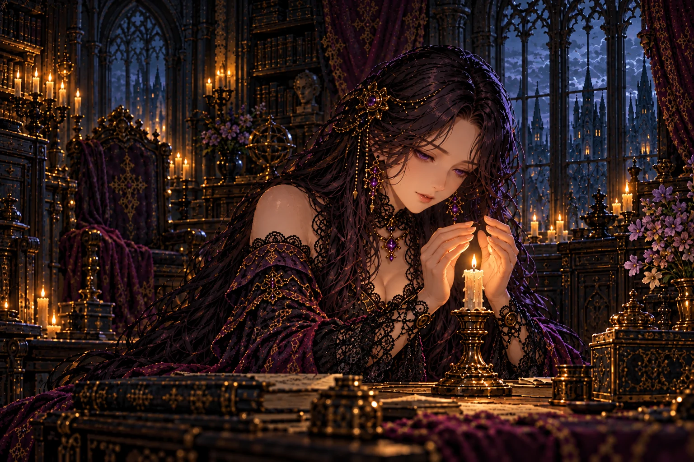

**ストーリー一覧の本文**

> 王の告白を聞いたあと、イレーヌは一年前の夜を語った。風もないのに、師の灯が消えかけた夜だった。
>
> 彼女は火を両手で囲み、そのまま朝を待った。何が起きているのか分からず、代わりに進むこともできず、ただ明かりの前に残った。
>
> 次の朝、火は戻った。それが何を意味するのかを、弟子はこれから探しに行く。館で過ぎた一晩と、迷宮の奥で起きた一瞬をつなぐために。

**ゲーム内 (館の語り IRENE_BEATS.irene_roots)**

> イレーヌ「王さまの話を聞きました。百年、魂脈で生きてきたそうですね。」
>
> 館の主は燭台の芯を整えながら、ぽつりと言った。
>
> イレーヌ「一年前の、ある夜のことです。この灯が、消えかけたのです。」
>
> イレーヌ「風もないのに、ふっと小さくなって……わたし、朝まで両手で囲っていました。」
>
> イレーヌ「次の朝には、元に戻っていました。……あの夜、オルド様に何かがあったのです。」
>
> イレーヌ「大穴の底へ行くのですね。灯の消えかけた理由を、見てきてください。」

## ch2_end「百年の底へ」 ── 出荷済み

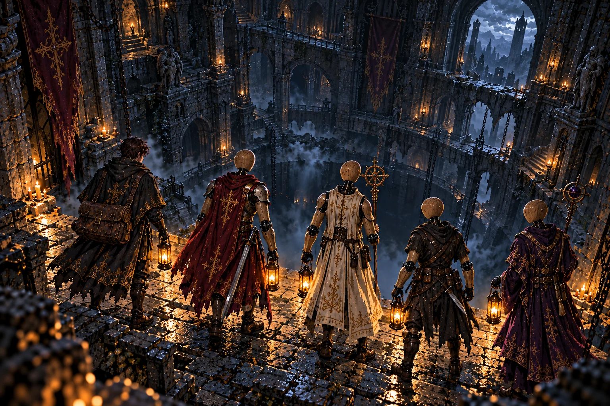

**ストーリー一覧の本文**

> 砦を失ったのは戦に敗れた兵だけではなかった。王国は、守ると約束した者を捧げ、そのことを先代の罪という言葉の奥へしまっていた。
>
> 独房で聞いたセラの声が、帰るべき場所を思い出させた。師は大穴のさらに下にいる。弟子の旅には、連れ帰りたい顔が増えた。
>
> 大穴の縁で、隊の灯が順に揺れた。今度こそ魂脈の根へ。百年前の命令を、今も続く仕事のままにしておくことはできなかった。

**ゲーム内 (章の結び CHAPTER_END[2])**

> 館の燭台の灯の傍らで、セラの木のまぶたが、また少しだけ動いた。
>
> 王は百年を生きた。その命を繋いできたのは、迷宮に呑まれた魂だった。
>
> 師は、本丸の大穴のさらに下。魂脈の根へ。
>
> ── 物語は第三章「魂脈の根」へ続く。

