# 第3章「魂脈の根」 の絵

書き出し: `node tools/storyart/review.mjs` (手で直さない)。絵は出荷する WebP、まだ無ければ原画。
ゲームで小さく出た時の見え方 (384×256): [chapter3-small.jpg](chapter3-small.jpg)

## w10_rope「二人が降りた綱」 ── 出荷済み (任意の修正あり)

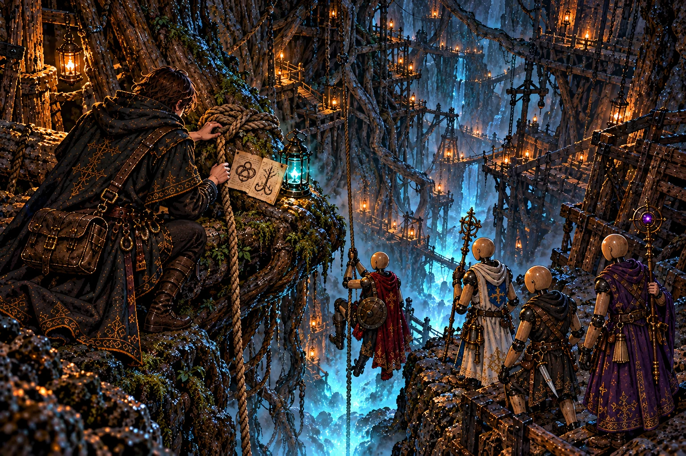

**ストーリー一覧の本文**

> 縦穴に絡む根の一本に、綱が結ばれていた。弟子は結び目を見て師の手を思い出した。重い荷でも解けず、必要な時にはほどける結び方だった。
>
> 書きつけには、根が一つの幹へ通じることが記されていた。師の言葉の下には、セラが短く返した文字がある。二人がここで同じ紙を見たのだ。
>
> 霧の湧く底へ、綱は続いている。弟子は隊を確かめ、最初の一人を降ろした。紙の上に残る二人の声を、そのまま奥へ持っていく。

**ゲーム内 (師の手がかり STORY_CELLS.w10_rope)**

> 縦穴の壁を這う太い根に、古い綱が結ばれていた。
>
> 結び目は、師がいつも荷を括るときの結び方だった。
>
> 綱の端に、油紙に包んだ書きつけが括りつけてある。
>
> ──『根を辿れ。根はすべて、一本の幹に通じている。セラ、遅れるな』
>
> その下に、小さく丁寧な字で一言。
>
> ──『はい』
>
> 綱は、霧の湧く底の森へまっすぐ垂れていた。
>
> ── 新たな迷宮「地の底の霧森」が地図に記された。

**修正 (任意)**

- 縦穴の灯の集落 (足場・吊り灯) を減らし、根の縦穴らしく

## report_w10「庭へ出られない王」 ── 出荷済み

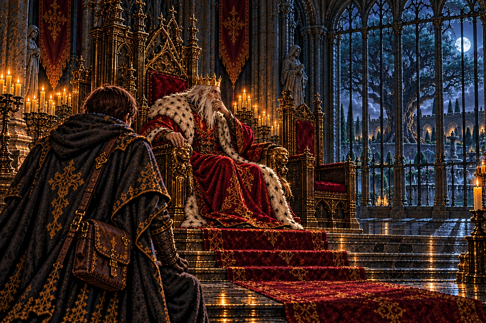

**ストーリー一覧の本文**

> 魂脈が根であったと伝えると、王は即位の日のことを思い出した。宰相モルデンは王宮の庭の古い木の前で、王の治世が長く続くようにと言ったという。
>
> 王自身は、長く庭へ出ることを禁じられていた。自分の命を支えるものがどこまで根を伸ばしたのか、見届けることさえ許されていない。
>
> 玉座の脇の席は空いていた。弟子は、王を生かすことと、王を自由にすることが別の仕事になっていると気付いた。

**ゲーム内 (王への報告 REPORTS.w10)**

> 「大穴の底まで降りたか。……根、と申したな。」
>
> 「余が冠を受けた日、宰相モルデンは王宮の庭の古い木の前で言った。『陛下の御代が、永く続きますように』と。」
>
> 「あの木の根が、いまどこまで伸びておるのか。余は、庭に出ることを禁じられて久しい。」
>
> 「オルドの綱が、底の森へ垂れておったか。あの男は、迷わず降りていったのだな。」
>
> 宰相の席は、今日も空いていた。

## w11_hut「三代の師弟が残す頁」 ── 出荷済み

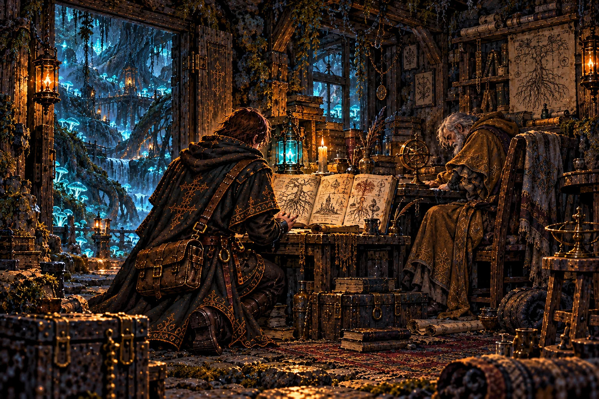

**ストーリー一覧の本文**

> 地下の森にある小屋で、ヴェルナーは机に向かったまま眠っていた。手記には、牢を抜けてから調べ続けた森の姿が残っている。
>
> 魂は木へ取り込まれ、魂脈は大樹の根として伸びる。三百年その木を育ててきたのは、宰相モルデンだった。ヴェルナーは自分にできなかった仕事を、弟子へ託していた。
>
> 最後の頁には、オルドが来たことを示す書き込みがあった。弟子はその余白を見つめた。師もここで同じ手記を読み、同じ人の眠る背を見たのだ。
>
> 受け継ぐのは技だけではない。終えられなかった仕事も、帰らなかった人への思いも、次の手に渡ってくる。

**ゲーム内 (師の手がかり STORY_CELLS.w11_hut)**

> 光る木々の間に、苔むした石の小屋があった。
>
> 机に突っ伏した骸。手元には、擦り切れた手記。表紙に『ヴェルナー』。
>
> ──『牢を抜けて十年。この森は、魂が木になる森だ。魂脈は、ひとつの大樹の根だった』
>
> ──『大樹を植えたのは宰相モルデン。三百年、あの男は根に水をやり続けている』
>
> ──『オルドよ。いつかお前がここへ来るなら──大樹の心臓を断て。私にはできなかった』
>
> 最後の頁の余白に、見慣れた師の字が書き足されていた。
>
> ──『先生。来ました。あとは任せてください』

## report_w11「庭師の長い歳月」 ── 出荷済み (任意の修正あり)

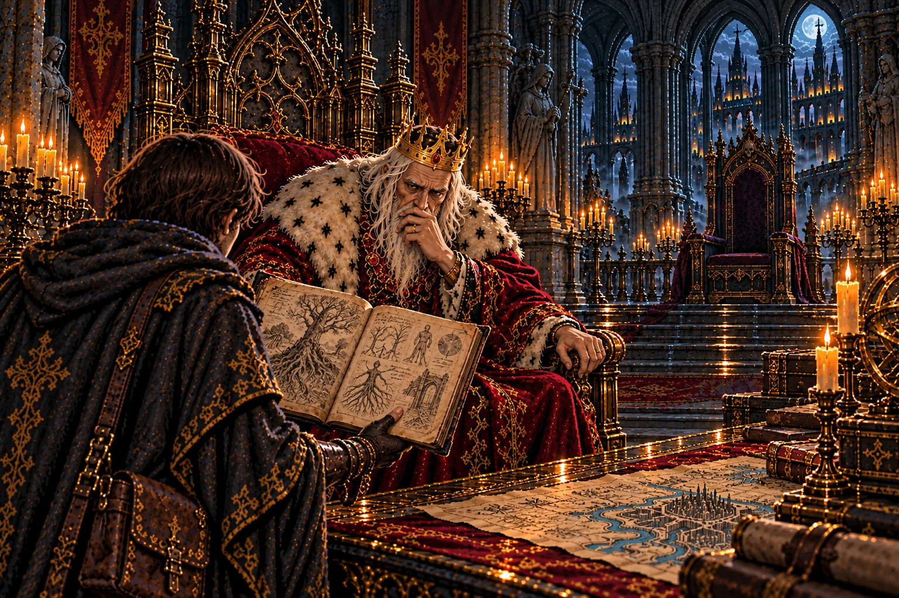

**ストーリー一覧の本文**

> ヴェルナーの最期を伝えると、王は自分の命令と食い違うことを認めた。処刑は済んだと、かつてモルデンから告げられていたのだ。
>
> 王が生まれる前から仕えていた男は、三百年、根に魂を送り続けている。王が信じた報告の数だけ、知らないままにされた出来事があった。
>
> 弟子は手記を持ち直した。迷宮で拾った紙が、王宮で長く信じられてきた言葉を崩していく。師が選んだ道の理由が、ようやく分かり始めていた。

**ゲーム内 (王への報告 REPORTS.w11)**

> 「底の森を抜けたか。…魂が木になる森、か。」
>
> 「ヴェルナーは、牢を抜けておったのか。余はあの男の処刑を命じた。モルデンが『済ませました』と申した。……あれも、嘘か。」
>
> 「三百年、根に水をやる庭師。…モルデンが余に仕えたのは、余が生まれる前からだ。」
>
> 「苗床も底の森も見たそなたになら、大樹の根元への道を開かせよう。」

**修正 (任意)**

- 奥の髑髏飾りの二つ目の玉座を、空いた宰相の椅子らしく小さく

## w12_torso「軽すぎる帰りの荷」 ── 出荷済み

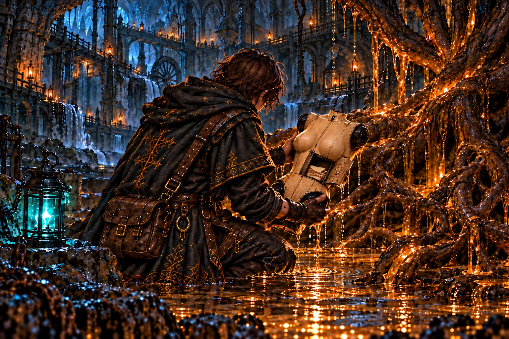

**ストーリー一覧の本文**

> 根が抱えていた胴を引き上げると、思いがけず軽かった。師の印と黒鉄の継ぎ目が、セラの器だと教えてくれる。
>
> 胸に残された紙から、師をかばった時に体が裂かれたことを知った。師は魂を自分の灯へつなぎ、器が離れてもセラを失わないようにしていた。
>
> イレーヌへ託す文字を読み、弟子は胸の扉を閉じた。帰りの荷が増えることを、これほど願ったことはなかった。館へ戻せるものが、また一つある。

**ゲーム内 (師の手がかり STORY_CELLS.w12_torso)**

> 苗床の底で、樹液の根が人業の胴を抱きかかえていた。
>
> 黒鉄の継ぎ目。背に彫られた、灯を掌に載せた手。セラの胴だ。
>
> 胸の小さな扉の中に、折り畳んだ紙が一枚。師の字だった。
>
> ──『セラは私を庇って、根に裂かれた。根の流れは器をばらばらに運ぶ。頭は牢へ、腕は水へ』
>
> ──『魂だけは、私の灯に結んでおいた。イレーヌ、この子を頼む』
>
> 胴は、驚くほど軽かった。

## report_w12「飲まれなくなった杯」 ── 出荷済み (任意の修正あり)

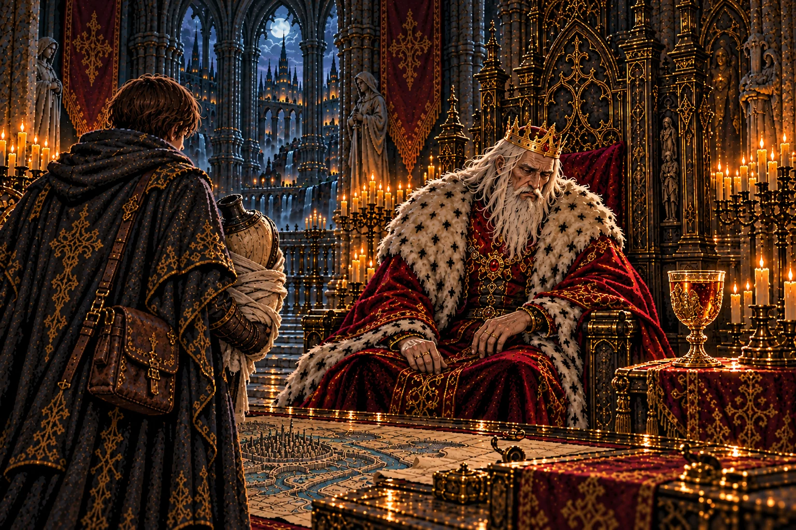

**ストーリー一覧の本文**

> 苗床の樹液の話を聞いて、王の視線が肘掛けの杯へ落ちた。百年、毎朝差し出されてきたものに、どこから命が届いていたのかが分かった。
>
> その日、王は杯に手を伸ばさなかった。長く生きるための仕草を一つ止めることが、玉座の間では大きな出来事に見えた。
>
> セラの胴を館へ戻すよう、王は言った。奪われる魂の話と、帰っていく器の話。弟子は後者を、自分の手で進めることができる。

**ゲーム内 (王への報告 REPORTS.w12)**

> 「苗床を見たか。…魂が溶けて、樹液になる、と。」
>
> 「余は百年、それを飲んできたのだな。毎朝、宰相が差し出す杯で。」
>
> 王は玉座の肘掛けの杯を見つめ、手を伸ばさなかった。
>
> 「オルドの人業の胴を見つけたか。館の主に返してやれ。…その子は、オルドを庇ったのだろう。」
>
> 「底の森も苗床も見たそなたになら、大樹の根元への道を開かせよう。」

**修正 (任意)**

- 杯を玉座の肘掛けの上に (本文「肘掛けの杯」)。抱えた包みを胴らしく (黒鉄の継ぎ目をのぞかせる)

## irene_torso「お帰りを重ねる仕事」 ── 出荷済み

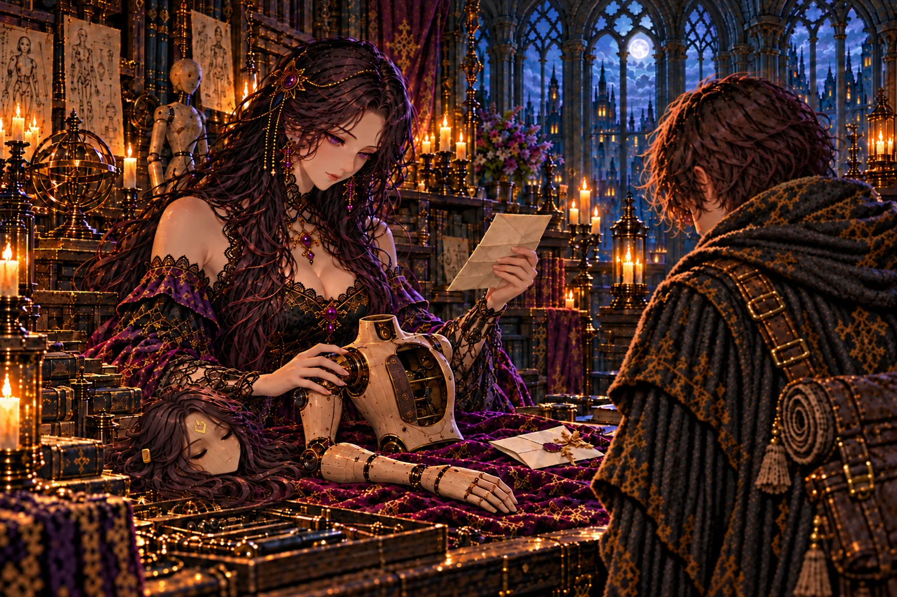

**ストーリー一覧の本文**

> セラの頭と腕のそばに、胴が置かれた。イレーヌは急いで組み立てず、戻ってきたものを一つずつ確かめた。足りない場所も、戻った場所も、よく知っている手だった。
>
> 師が胸に残した紙を読み、彼女はセラが誰を守ったのかを知った。昔からそんな子だったと語る声に、責める響きはなかった。
>
> まだ脚が足りない。師も帰っていない。それでも館の台の上には、別々の場所から取り戻された仲間がいる。弟子は空いている場所を見て、次に持ち帰るものを考えた。

**ゲーム内 (館の語り IRENE_BEATS.irene_torso)**

> イレーヌ「……お帰りなさい、セラ。」
>
> 館の主は胴を抱きとめ、燭台の傍らの頭と腕のそばに、そっと並べた。
>
> イレーヌ「頭と、腕と、胴。……あとは脚だけですね。」
>
> イレーヌ「この子、オルド様を庇ったのですね。昔から、そういう子でした。」
>
> 彼女は胴の扉から師の紙を取り出し、何度も読み返した。
>
> イレーヌ「『この子を頼む』とのことです。……頼まれなくても、わかっているのですが。」

## mem_w13「魂の流れを登る師」 ── 出荷済み

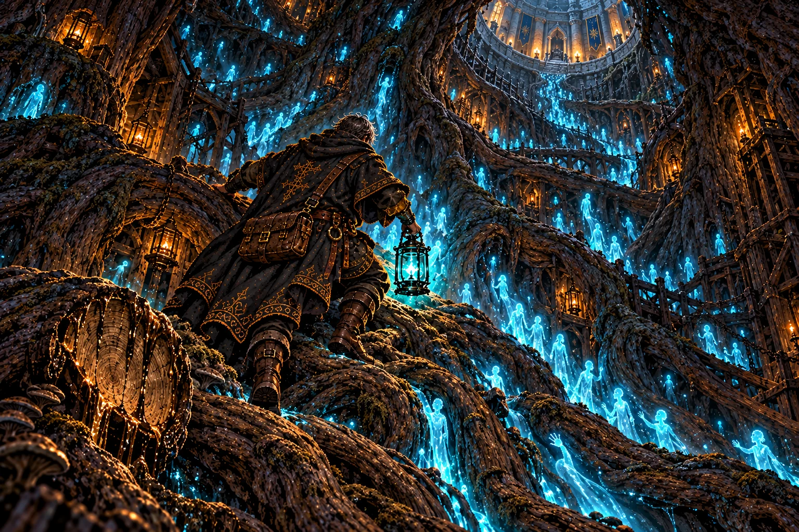

**ストーリー一覧の本文**

> 大樹の主が鎮まると、弟子は師が根を断った日の記憶を見た。木の叫びが地の底へ広がり、遠い館で守られる灯を思わせた。
>
> だが木の心臓は根元にはなかった。幹の内側は空洞で、取り込まれた魂の光が上へ流れている。師はその中へ入り、王都へ向かって登った。
>
> 記憶の奥へ消える背中に、弟子は呼びかけることができなかった。けれど、もう行き先は分かる。地下の道は、玉座の下へ続いていた。

**ゲーム内 (主の記憶 BOSS_MEMORIES.w13)**

> 霧の森の主が崩れると、絡み合った無数の魂が、ひとつずつほどけていった──
>
> ……一年前。大樹の根元に、旅装の男が立っていた。
>
> 男はのこぎりのように研いだ刃で、いちばん太い根を断った。大樹が、地の底いっぱいに叫んだ。
>
> 遠い館で、燭台の灯が消えかけた夜だった。
>
> ──『心臓は、根元には無いのか。……幹の中か』
>
> 幹はうつろで、その内を魂の流れが、上へ、上へと昇っていた。王都の方角へ。
>
> ──『灯を絶やすな、イレーヌ。私は、幹を登る』
>
> 男の姿は、昇る光の中に消えた……

## report_w13「微笑む宰相、老いていく王」 ── 出荷済み

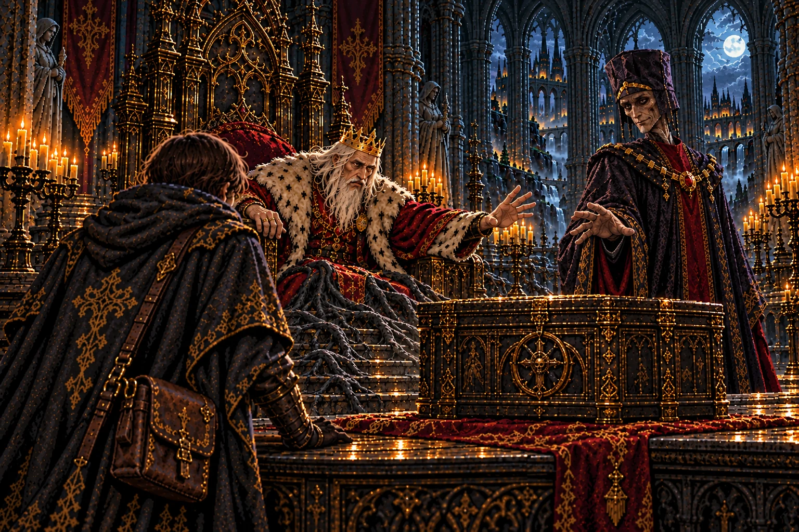

**ストーリー一覧の本文**

> 大樹の主を討った報告をする頃、王の衰えが目に見えるようになった。魂を送る木に変化が起きれば、つながれた命も変わるのだ。
>
> モルデンは玉座の陰から姿を見せた。弟子の働きを認める言葉のあとに、幹には触れないよう求めた。笑みの理由を、今は誰も確かめなかった。
>
> 王は宰相を退け、幹が玉座の下へ届くことを告げた。師がいる先を隠すことを、もう選ばなかった。
>
> 迷宮の奥へ進む旅は、王国の中心へ戻ってくる。弟子は師のために歩き始めた道で、師が向き合ったものと向き合おうとしていた。

**ゲーム内 (王への報告 REPORTS.w13)**

> 「大樹の主を討ったか。……昨夜、玉座の下で、何かがきしんだ。」
>
> 王は咳き込んだ。一晩で、髪がさらに白くなったように見えた。
>
> 「根を断たれた木は、枯れる。そして、木に繋がれた者もな。」
>
> 玉座の陰から、宰相モルデンが音もなく歩み出た。
>
> 宰相モルデン「陛下。弟子殿のお働き、まことに見事にございます。……ですが、幹にだけはお手を触れませぬよう」
>
> 「下がれ、モルデン。」
>
> 宰相は微笑んで一礼し、闇へ溶けるように退いた。
>
> 「幹は王都の地下を登り、この玉座の真下に至る。オルドは、そこにおる。」
>
> 「弟子よ。いずれ、余を斬りに来るがよい。……オルドの代わりにな。」

## ch3_end「帰る場所から、玉座の下へ」 ── 出荷済み

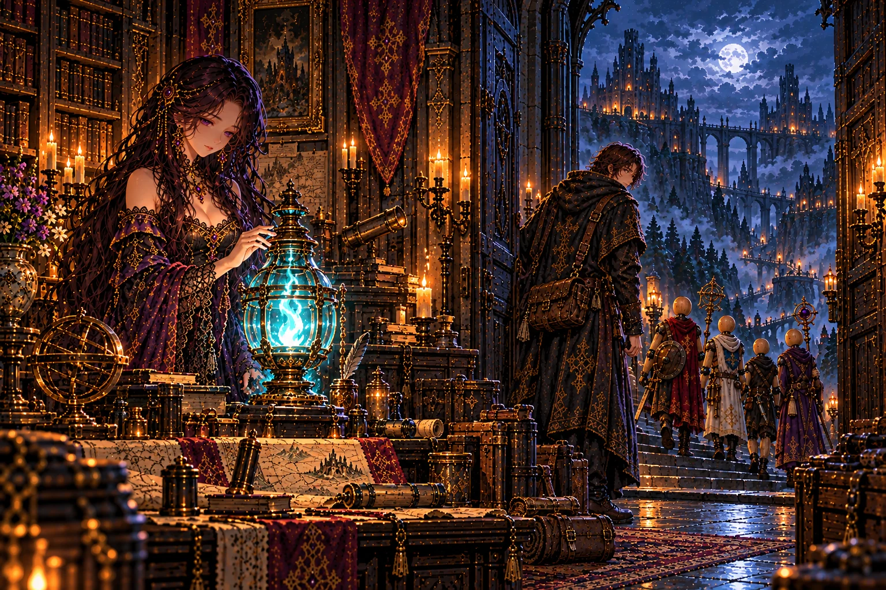

**ストーリー一覧の本文**

> 館の灯が高く燃えた夜、弟子は地下で見た師の背中を思い出した。流れる魂の光の中を、ひとり、先へ進む人。
>
> 館では人業を仕立てる台が、明日の支度を待っている。隣には、灯を守るイレーヌがいる。探す理由は初めてこの街へ来た日と同じだったが、連れ帰りたい顔は増えていた。
>
> 次の道は王都の地下へ続く。弟子は支度を整える前に、館の扉を振り返った。終わった時に帰る場所を、今度は自分の目で確かめてから。

**ゲーム内 (章の結び CHAPTER_END[3])**

> その夜、館の燭台の灯が、ひときわ高く燃え上がった。
>
> 一年前、師は大樹の幹の中を、魂の流れに乗って登っていった。王都の地下へ。玉座の真下へ。
>
> 三百年、根に水をやってきた庭師は、まだ微笑んでいる。
>
> ── 物語は第四章「王都の地下」へ続く。

## irene_trust「扉を開けた日のこと」 ── 出荷済み

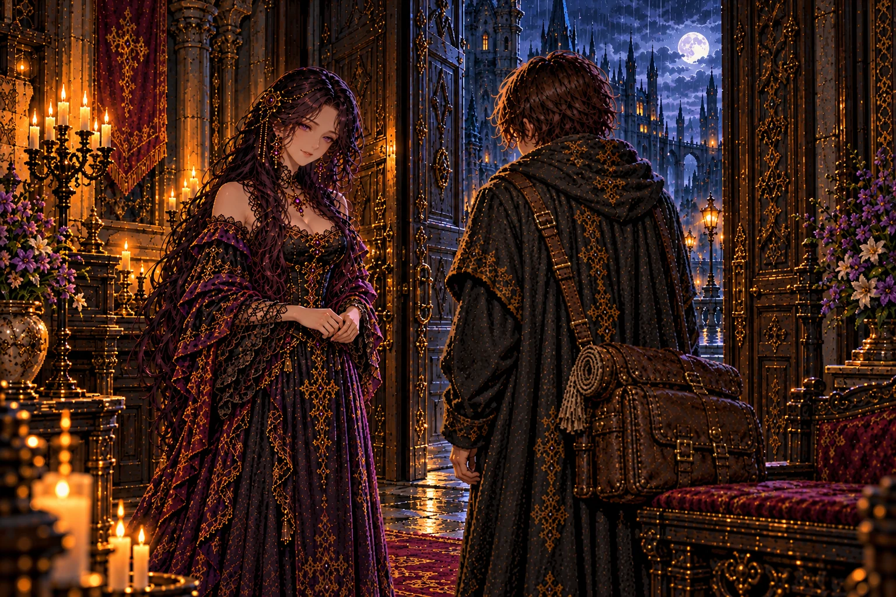

**ストーリー一覧の本文**

> イレーヌが初めて会った日の話をしたのは、いくつもの迷宮を歩いたあとだった。よそよそしく迎えた理由を、彼女はようやく言葉にした。怖かったのだという。
>
> 弟子は、旅の荷を置く場所が用意されていたことを思い出した。距離を置きながらも、彼女は扉を閉じなかった。待つ人が増えることを恐れ、それでも迎えてくれたのだ。
>
> 過ぎた日の挨拶をやり直す必要はなかった。弟子はその日も館へ戻ってきた。イレーヌは、その帰りを知る場所に立っていた。

