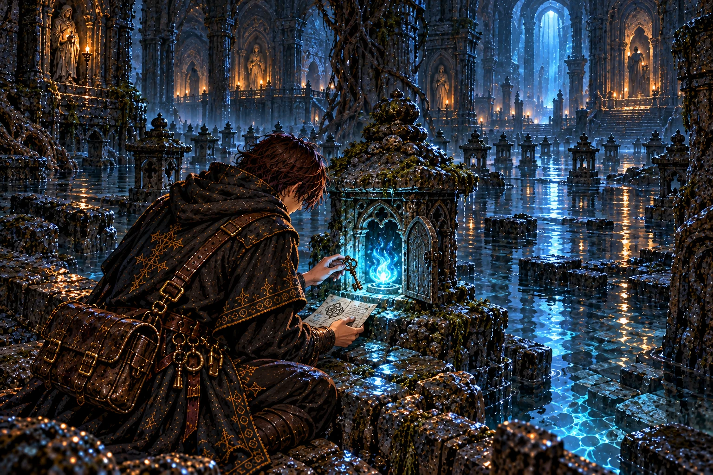
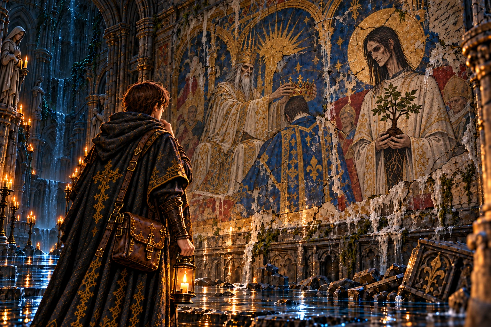
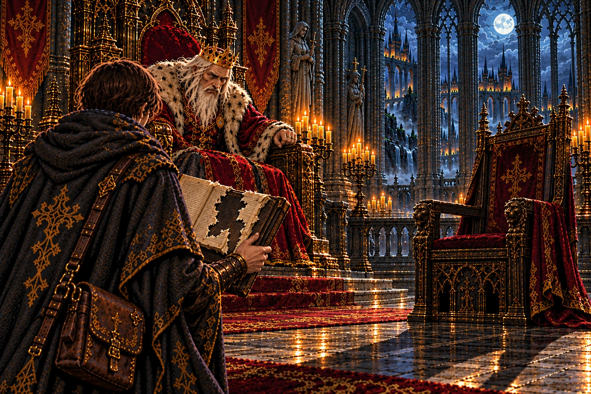
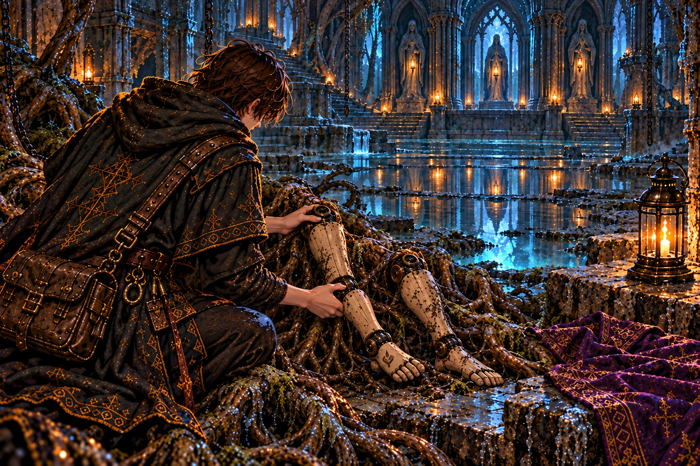
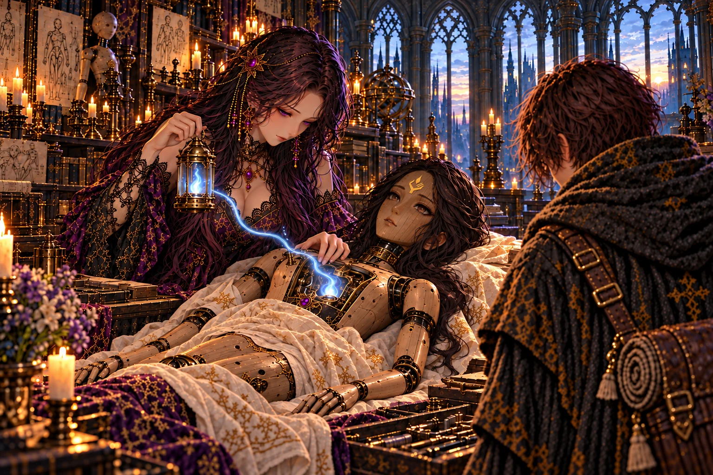
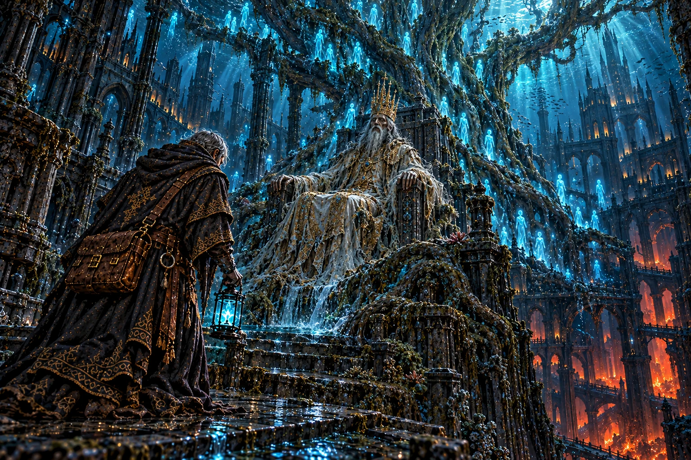
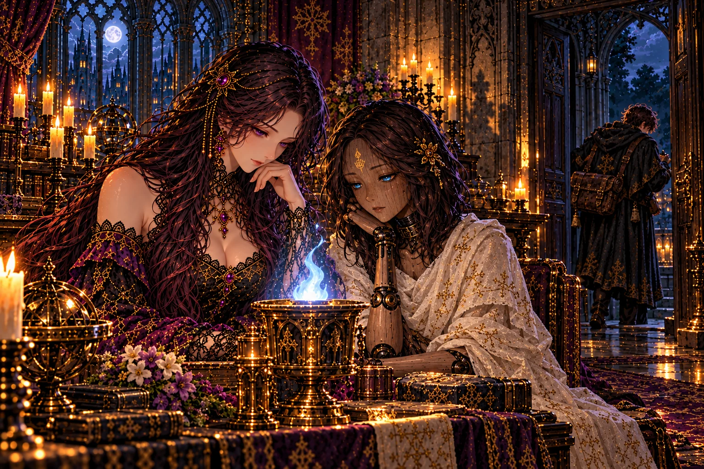

# 第4章「王都の地下」 の絵

書き出し: `node tools/storyart/review.mjs` (手で直さない)。絵は出荷する WebP、まだ無ければ原画。
ゲームで小さく出た時の見え方 (384×256): [chapter4-small.jpg](chapter4-small.jpg)

## w14_lamp「水底に残された灯」 ── 出荷済み (任意の修正あり)

**ストーリー一覧の本文**

> 沈んだ参道には、石の灯籠が奥へ向かって並んでいた。水に浸かった灯籠のうち、一つだけが青白く光り続けていた。
>
> 火袋の中から出てきたのは、聖歌の回廊へ抜ける鍵と、師の短い書きつけだった。師は先へ進みながら、後から来る者の道も残していた。
>
> 書きつけの最後には、流されたセラの脚のことがあった。師は自分の旅の途中でも、裂かれた人業を忘れていなかった。弟子は鍵を握り、回廊の方角を確かめた。

**ゲーム内 (師の手がかり STORY_CELLS.w14_lamp)**

> 水に沈んだ参道に、石の灯籠がどこまでも並んでいた。
>
> ひとつだけ、青白い灯がともっている。笠に刻まれているのは──灯を掌に載せた手。
>
> 灯籠の火袋に、油紙に包んだ鍵と書きつけが入れてあった。
>
> ──『幹はこの参道の真下を昇っている。聖歌の回廊を抜ければ、神殿の裏へ出られる』
>
> ──『セラの脚が、幹を昇る流れに運ばれていった。見つけた者は、館へ届けてほしい』
>
> ── 新たな迷宮「溺れた聖歌の回廊」が地図に記された。

**修正 (任意)**

- 灯籠の笠に掌に炎の印

## report_w14「足元に沈む都」 ── 出荷済み

**ストーリー一覧の本文**

> 参道の話を聞いた王は、王都が古い都の上に築かれたという言い伝えを口にした。それは三百年前、王が生まれるより前の出来事だった。
>
> 毎日歩いている石畳の下に、水に沈んだ都がある。王宮も街も、誰かの終わった暮らしの上に建っていた。
>
> 王は洗礼の大水槽への道を開かせた。空いたままの宰相の席を、弟子は一度だけ見た。

**ゲーム内 (王への報告 REPORTS.w14)**

> 「王都の足元に、もうひとつの都があったか。」
>
> 「…余も聞いたことはある。王都は、沈んだ旧都の上に築かれたと。三百年前、余が生まれるよりずっと前のことだ。」
>
> 「オルドの鍵で、聖歌の回廊へ抜けられるか。あの男は、行く先々に灯を置いてゆく。」
>
> 「洗礼の大水槽への道も開かせよう。旧都の王は、そこで身を清めてから冠を受けたという。」
>
> 宰相の席は、今日も空いていた。

## w15_mural「老いない横顔」 ── 出荷済み・修正待ち

**ストーリー一覧の本文**

> 回廊の壁には、旧都の戴冠を描いた絵が残っていた。冠を受ける王の脇に、苗木を抱えた若い神官が描かれている。
>
> その顔を見て、弟子は息を止めた。王宮で何度も見た宰相モルデンと、一つも変わらない。三百年分の時が、その顔にだけ触れていなかった。
>
> 絵の隅に師が書き残した問いは、答えを持たないまま壁に残っていた。弟子は同じ問いを胸にしまい、回廊の奥へ進んだ。

**ゲーム内 (師の手がかり STORY_CELLS.w15_mural)**

> 水を吸ってふくらんだ壁に、色あせた壁画が残っていた。
>
> 冠を受ける王。白い法衣の神官王が、泉の前で冠を掲げている。
>
> その脇に、苗木を抱いた若い神官が立っていた。
>
> 痩せた長身。白い顔。薄い笑み。──三百年前の絵に、宰相モルデンがいた。
>
> 壁画の隅に、師の字が書き足されていた。
>
> ──『顔が、一日も老いていない。モルデン、お前は何だ』

**修正 A-16**

- 直す (1): 壁画の若い神官が、いまのモルデンと「一つも変わらない」顔に見えない → 正典のモルデンと同じ顔 (やせて青白く、薄い笑み)。白い法衣の若い神官として描き、苗木を抱く。
- 直す (2): 冠を授ける王が、いまの王そっくり → 三百年前の神官王 (白と金の法衣、`chapter4/mem_w17.png` の神官王と同じ)。泉の前で冠を掲げる。
- 直す (3): 地下なのに満月の夜空 → 窓を消すか、水没した暗い神殿の壁に。
- 直す (4): 絵の隅に師の短い書き込み (読めない走り書き) を添える。

## report_w15「名の残らない神官」 ── 出荷済み

**ストーリー一覧の本文**

> 回廊の話を伝えると、王は肘掛けを握った。旧都の王の脇に控えた神官の名は、記録のどこにも伝わっていないという。
>
> 三百年前の記録だけが抜き取られている。誰かが消したのだとすれば、それは記録を扱える場所にいた者だ。
>
> 王はそれ以上を口にしなかった。玉座の間に、空いた宰相の席の影が長く伸びていた。

**ゲーム内 (王への報告 REPORTS.w15)**

> 「聖歌の回廊を抜けたか。…まだ、歌っておったか。」
>
> 「壁画に、モルデンがおったと。……三百年前の絵に、いまと同じ顔で。」
>
> 王は玉座の肘掛けを強く握った。「老いぬことは知っておった。余と同じく、杯で永らえておるのだと思うておった。……だが余は、杯を飲んでも老いてゆく。あれだけが、三百年、何も変わらぬ。」
>
> 「回廊も水槽も見たそなたになら、大神殿の扉を開かせよう。」

## w16_legs「根の中を歩いた脚」 ── 出荷済み・修正待ち

**ストーリー一覧の本文**

> 水の引いた大水槽の底で、根の筋が人業の脚を抱えていた。黒鉄の継ぎ目と、くるぶしの印が、セラのものだと告げていた。
>
> 脚には細い傷がいくつも残っていた。流れに運ばれながら、根の中を自分の足で進もうとした跡のように見えた。
>
> 頭、腕、胴、そして脚。別々の迷宮で拾い集めたものが、これで一人の形になる。弟子は脚を丁寧に包み、館への帰り道を急いだ。

**ゲーム内 (師の手がかり STORY_CELLS.w16_legs)**

> 水の引いた大水槽の底で、根の筋が何かを抱えていた。
>
> 人業の脚が一対。黒鉄の継ぎ目。くるぶしの内側に、灯を掌に載せた手。
>
> 幹を昇る流れに運ばれ、ここで根に絡め取られたのだろう。
>
> 脚には、細い傷がいくつも残っていた。根の中を、自分の足で歩こうとした跡のように。
>
> 頭と、腕と、胴と、脚。……これで、セラの体がそろう。
>
> 館へ連れて帰らなければ。

**修正 A-19**

- 直す: すねの正面のランタンの線画 → 消す。**くるぶしの内側**に小さく、掌に炎を載せた手の印。

## report_w16「破られた誓いの水」 ── 出荷済み

**ストーリー一覧の本文**

> 大水槽は、旧都の王が民の魂を守ると誓って身を清めた場所だった。王はその話をしながら、自分も同じ誓いを立てたことを明かした。
>
> そして百年前に、その誓いを破ったことも。王の声は低かったが、言葉を選んで隠すことはしなかった。
>
> 破った誓いの重さを、王は誰かに預けようとはしなかった。弟子は黙って聞き、館で待つ台のことを思った。

**ゲーム内 (王への報告 REPORTS.w16)**

> 「大水槽の底まで降りたか。」
>
> 「オルドの人業の脚を、見つけたそうだな。館の主に届けてやれ。……その子が歩くところを、余も一度見てみたい。」
>
> 「旧都の王は、あの水で身を清め、民の魂を守ると誓って冠を受けた。」
>
> 「余も、同じ誓いを立てた。……百年前に、破った。」
>
> 「回廊も水槽も見たそなたになら、大神殿の扉を開かせよう。」

## irene_sera_wake「灯が移った夜明け」 ── 出荷済み・修正待ち

**ストーリー一覧の本文**

> セラの体がそろっても、魂は師の灯に結ばれたままだった。イレーヌが手に取ったのは、弟子が最初の迷宮で拾ったランタンだった。
>
> ガラスの中の青白い火は、ずっと師の一部として揺れていた。イレーヌは一晩をかけて継ぎ目を締め、夜明け前、火はセラの胸へ移った。
>
> 目を開けたセラが最初に尋ねたのは、師の行方だった。答えを聞くと、彼女は自分も行くと言った。旅の荷に、帰ってきた仲間の分が加わった。

**ゲーム内 (館の語り IRENE_BEATS.irene_sera_wake)**

> イレーヌ「……脚、ですね。」
>
> 館の主は脚を受け取ると、燭台の傍らの台に、頭と腕と胴と並べた。
>
> イレーヌ「この子は、オルド様が戻らないかぎり目を覚まさない、と言いました。魂が、あの方の灯に結ばれているからです。」
>
> イレーヌ「でも……オルド様の灯なら、ここにあります。」
>
> 彼女が手に取ったのは、地下墓地で見つけた、師のランタンだった。ガラスの内側で、青白い魂火が揺れている。
>
> イレーヌ「あなたが、最初の迷宮から持ち帰ってくれた灯です。」
>
> 館の主は一晩かけて、継ぎ目をひとつずつ締め直した。夜明け前、ランタンの魂火が、セラの胸の扉へ移った。
>
> 木のまぶたが、ゆっくりと開いた。
>
> セラ「……イレーヌ。……オルド様は?」
>
> イレーヌ「まだです。……でも、この方が、あの方の足跡を辿ってくれています。」
>
> セラ「お弟子さま。……牢で、お会いしましたね。」
>
> セラ「わたしも行きます。オルド様は、大樹の幹の中へ登っていきました。わたしは、その手前で、根に裂かれたのです。」
>
> セラ「今度は、最後までついて行きます。」
>
> ── セラが仲間に加わった。メイン魂はセラだけの職「灯守」(仲間を庇い、灯の加護で守る)。師の作った器は、魂の安定度を消費しない。サブ魂は自由に付け替えられる。

**修正 A-17**

- 直す: 本文は「彼女が手に取ったのは、地下墓地で見つけた、師のランタンだった」。いまの絵は大きな据え置きのガラス灯器 → イレーヌが師のランタン (`chapter1/w01_lantern.png` の小さな真鍮の手提げランタン、青白い魂火) を手に持ち、その火が筋になってセラの胸へ流れ込む。セラは正典 (本物の黒髪・額の印)。

## mem_w17「水の底の戴冠」 ── 出荷済み・修正待ち

**ストーリー一覧の本文**

> 神官王の魂がほどけると、弟子は三百年前の戴冠の夜を見た。泉に苗木が植えられ、抜けという命令の後に、都は水へ沈んだ。
>
> 王は冠をかぶったまま、水の底で苗木が幹になるのを見続けていた。止められなかったものを、見届けることしかできなかったのだ。
>
> 一年前、幹を昇ってきた師はその王に頭を下げ、木の心臓が樹液を煮詰める釜にあると見抜いた。そして、熱い風の吹く底へ降りていった。

**ゲーム内 (主の記憶 BOSS_MEMORIES.w17)**

> 神官王が崩れると、水に溶けた古い魂が、ゆっくりと立ちのぼった──
>
> ……三百年前、戴冠の夜。泉の前で冠を受けた王の脇に、若い神官が立っていた。
>
> 神官は苗木を泉に植えた。──『陛下の御代が、永く続きますように』
>
> 王は苗木を抜けと命じた。その夜、神殿の床が割れ、旧都は一夜で水に沈んだ。
>
> 水の底で、王は冠をかぶったまま、三百年、苗木が育つのを見ていた。
>
> ……一年前。幹を昇ってきた男が、王の前に膝をついた。手には、根を断った刃だけを握っていた。
>
> ──『心臓は幹にも、冠にも無い。樹液を煮詰める釜だ。……神殿の底に、火の洞があるのだな』
>
> ──『陛下。三百年、ご苦労でした。あとは、私が』
>
> 男は祭壇の割れ目から、熱い風の吹く底へ降りていった……

**修正 A-15**

- 直す: 本文は「幹を昇ってきた男が、王の前に膝をついた。手には、根を断った刃だけを握っていた」。いまの絵は立ったまま、師のランタンを提げ、刃が無く、弟子と同じ外套 → 正典のオルドが神官王の前に片膝をつき、右手にのこぎりのような刃だけを握る。ランタンを消す。

## report_w17「杯を遠ざけた手」 ── 出荷済み

**ストーリー一覧の本文**

> 神官王の記憶を伝えると、王は宰相が仕えてきた年月を数えるのをやめていたと言った。祖父の祖父の代よりも、さらに前から。
>
> 毎朝差し出される杯が、どこで煮詰められているのか。王はそれを知って、杯を遠ざけた。
>
> 王は神殿の底へ降りる許しを出した。行き先は火の洞。弟子は、師がそこで何を見たのかを確かめに行く。

**ゲーム内 (王への報告 REPORTS.w17)**

> 「神官王を鎮めたか。……三百年、水の底で冠をかぶっておったか。」
>
> 王に、神官王の記憶を話した。若い神官が泉に苗木を植え、旧都が一夜で沈んだことを。
>
> 「モルデンは、余の祖父の祖父の代よりも前から、宰相であった。……数えるのを、いつしかやめていた。」
>
> 王は咳き込み、肘掛けの杯を遠ざけた。
>
> 「心臓は樹液を煮詰める釜、と申したな。余の毎朝の杯は、その釜で煮詰められておるのだろう。」
>
> 「神殿の底へ降りる許しを出そう。熱い風の吹く、火の洞へ。」

## ch4_end「二つ並んだ影」 ── 出荷済み・修正待ち

**ストーリー一覧の本文**

> 館の燭台の前で、イレーヌはセラのそばに座っていた。灯を見守る目が、少しずつ増えていく。
>
> 王都の足元に沈んだ都を見て、弟子は自分たちの暮らしの下にある長い時を知った。三百年前に植えられた苗木は、いまも一人の男の手で育てられている。
>
> 師は火の洞へ向かった。追う理由は増えたが、帰る場所もまた温かくなっていた。弟子は次の支度にかかった。

**ゲーム内 (章の結び CHAPTER_END[4])**

> 館の燭台の灯が、セラの木の頬を照らしている。
>
> 王都の足元には、三百年前に沈んだ都が眠っていた。苗木を植えた若い神官は、いまも同じ顔で微笑んでいる。
>
> 師は、樹液を煮詰める釜を目指して、神殿の底の火の洞へ。
>
> ── 物語は第五章「灼熱の洞」へ続く。

**修正 A-18**

- 直す (1): 中央の灯が真鍮の杯の青い炎 → 燭台の白い蝋燭 (本文「館の燭台の灯が、セラの木の頬を照らしている」)。
- 直す (2): セラの頬杖の腕の節が一つ多い → 正しい腕 (肩・肘・手首)。

