# 踏破した迷宮の由来の絵

書き出し: `node tools/storyart/review.mjs` (手で直さない)。絵は出荷する WebP、まだ無ければ原画。
ゲームで小さく出た時の見え方 (384×256): [dungeons-small.jpg](dungeons-small.jpg)

## lore_w01「忘れられた地下墓地」 ── 出荷済み (任意の修正あり)

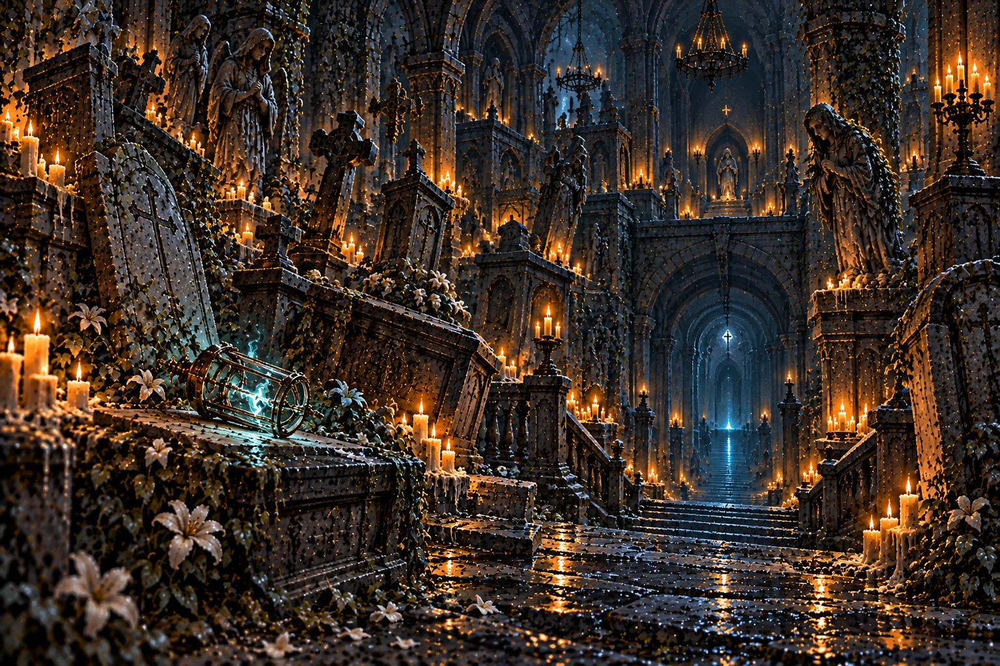

**ストーリー一覧の本文**

> ロアダルの墓所の下。師オルドが最後に降りたと伝わる
>
> この地下墓地は、ロアダルの人々が名を失った死者にも眠る場所を与えた墓所だった。
>
> 棺の内側には、外へ向けて引っかいた跡が残る。死者は侵入者に起こされたのではない。地下から呼ぶ声に、眠りを奪われていた。
>
> 今は、どの棺も下へ続く暗がりに向いている。墓地は迷宮の入口へと変わってしまった。

**修正 (任意)**

- ランタンの形を `w01_lantern.png` に合わせる (横倒しの筒にしない)

## lore_w02「亡骸の囁く回廊」 ── 出荷済み

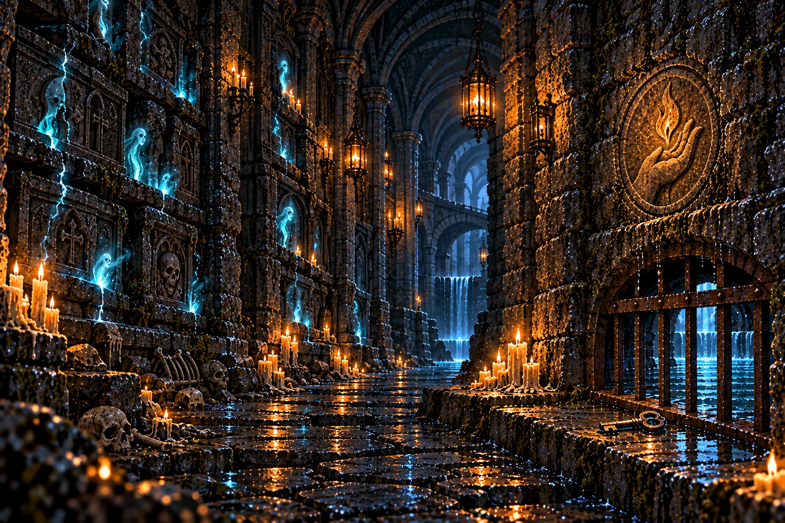

**ストーリー一覧の本文**

> 墓地の奥へ続く長い回廊。壁の向こうから死者の囁きが漏れる
>
> 回廊の壁は、墓地を広げるたびに積み直された。古い棺は石壁の奥に置き去りにされたという。
>
> 壁の向こうの囁きは、閉じ込められた死者の声だ。声を聞く者へ、出口の場所を尋ね続けている。
>
> 奥の鉄格子は水路につながっていた。墓を守るための道と、街へ水を送る道が、地下で接していたのだ。

## lore_w03「朽ちた骸の修道院」 ── 出荷済み

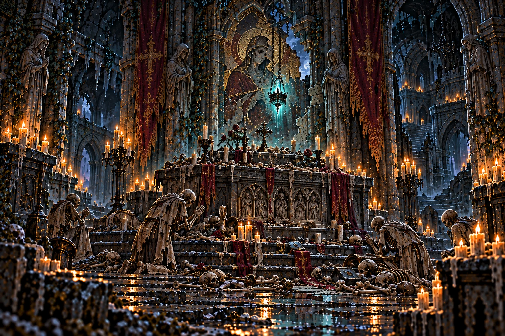

**ストーリー一覧の本文**

> 死者を弔い続けた修道士たちの成れの果て。最下階に骸の修道院長が待つ
>
> 修道士たちは、埋葬しきれない死者をここで弔っていた。祈りは昼夜を問わず続いた。
>
> 死者が歩き始めても、修道士たちは逃げなかった。祈りをやめれば、弔った者を見捨てることになると考えたのだ。
>
> 祭壇の前に重なる骨は、最後まで祈った者たちのものだ。修道院を縛るのは信仰の深さと、祈りを終えられなかった悔いだった。

## lore_w04「黒水の取水口」 ── 出荷済み

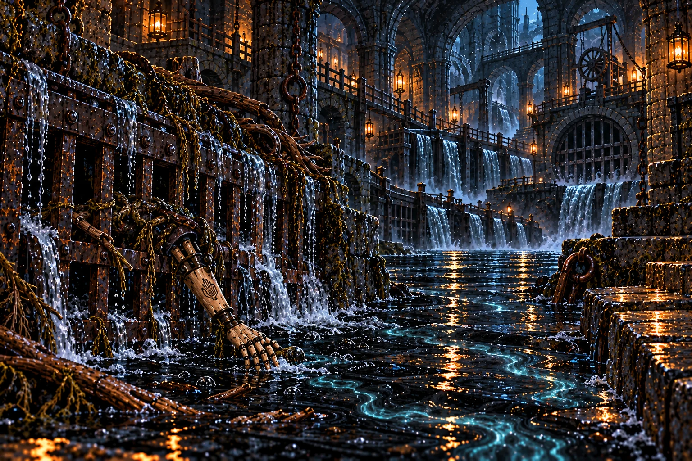

**ストーリー一覧の本文**

> 王都へ流れる黒い水の入口。水に触れた者は影が薄くなるという
>
> 取水口は、ロアダルの暮らしを支えた水の入口だった。人々は水の行く先だけを知り、その来る場所を知らなかった。
>
> 底の格子には木片と黒鉄の輪が引っかかっている。人業の器さえ、地下を巡る水に運ばれてくる。
>
> 街へ送られる水の下を、黒い流れがもう一本走っている。それは墓所よりも深く潜り、王都の方角へ消えていく。

## lore_w05「鎖の垂れる坑口」 ── 出荷済み

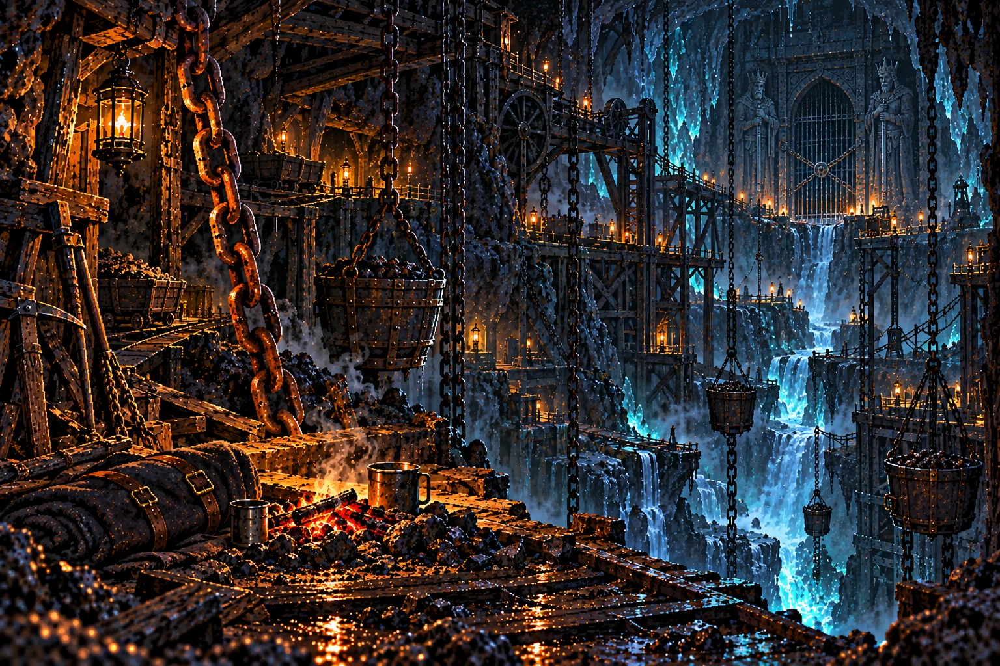

**ストーリー一覧の本文**

> 王家が封じた古の坑道。罪人たちの鎖が、今も闇に垂れている
>
> 坑口に垂れた鎖は、鉱石の籠を吊り上げるためのものだった。作業を終えた鉱夫たちの灯が、昔は毎晩ここへ戻った。
>
> 今も奥では鎖が動き、つるはしの音が響く。働く者が倒れたあとも、坑道だけが仕事を続けている。
>
> 踏破した底には、水に削られた裂け目があった。鉱夫が掘った道は、彼らの知らない地下の流れへ届いていた。

## lore_w06「亡兵の守る外郭」 ── 出荷済み

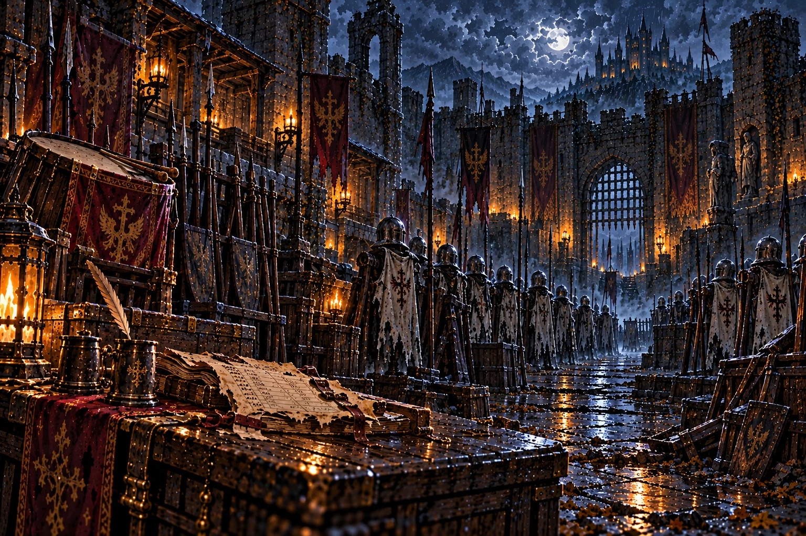

**ストーリー一覧の本文**

> 国境の捨て砦の城壁と兵舎。百年前に死んだ守備隊が、いまも隊列を組んで持ち場を守る
>
> 外郭は国境の守りの要だった。兵は持ち場を離れず、交代の合図だけを待っていた。
>
> 亡兵が今も隊列を組むのは、生前の命令を覚えているからだ。最後の当直簿には、交代した者の名がない。
>
> 迎えも援軍も来ないまま、守備隊は砦とともに取り残された。忠義だけが、彼らを門の前へ立たせ続けている。

## lore_w07「捨て砦の地下牢」 ── 出荷済み・修正待ち

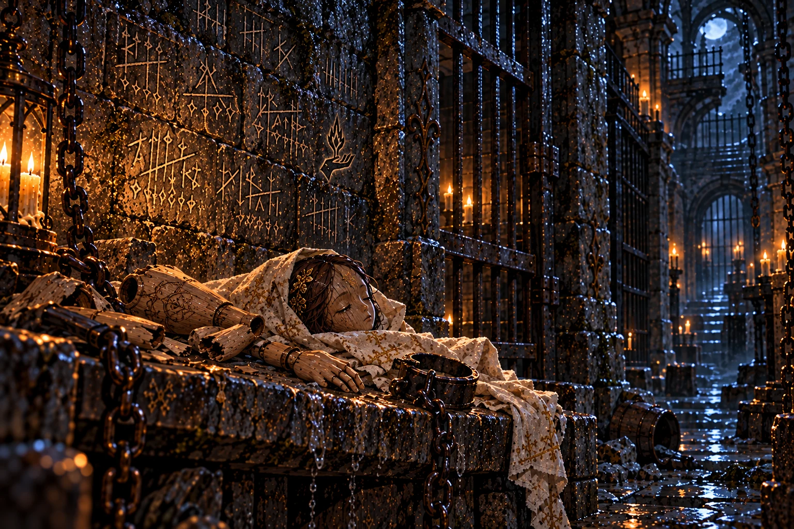

**ストーリー一覧の本文**

> 砦の地下に掘られた牢。捕虜と罪人と、王に背いた者たちが、鍵を掛けられたまま忘れられた
>
> 地下牢には敵兵だけでなく、王に仕えた操霊師の名も刻まれていた。仕える者が、なぜここへ送られたのか。
>
> 壁の名は、忘れられないための最後の記録だった。閉ざされた獄は、罪を裁く場所であると同時に、人の足跡を消す場所でもあった。
>
> 牢の底に残った木と鋼の欠片は、ここまで降りた人業の存在を語る。牢を出る道は、地上へだけ続いていたのではない。

**修正 A-20**

- 直す: セラの頭のそばに木の手・前腕・手足の筒が並び、一体分あるように見える (腕は取水口・胴は苗床・脚は大水槽で見つかる) → 頭だけにする。髪は正典の色、額の印を正典の形に。

## lore_w08「雷雨の大手門」 ── 出荷済み

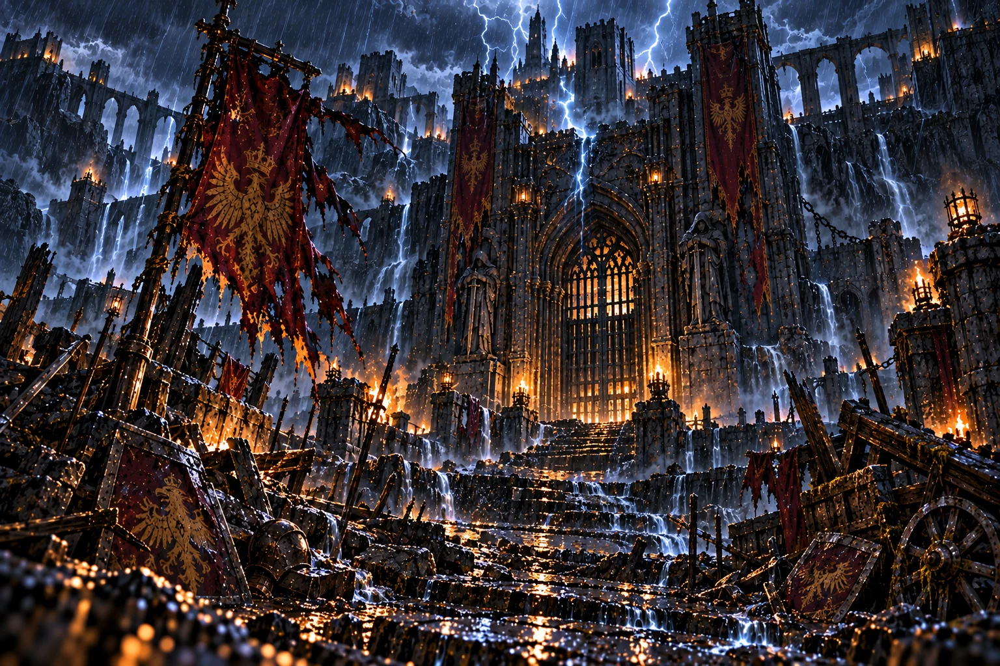

**ストーリー一覧の本文**

> 寄せ手が最後に破った砦の正門。あの日の雷雨はいまも止まず、討ち死にした両軍の亡者が門を奪い合う
>
> 大手門の軍旗は、援軍が来る方角へ掲げられていた。雨に打たれても、旗を下ろす者はいなかった。
>
> 兵の魂が守るのは、砦を破ろうとする敵だけではない。門を開けば見捨てられたことを認めてしまう、その恐れも彼らを縛っていた。
>
> 雷雨は途切れず、旗は焦げたまま揺れている。待ち続けた守備隊にとって、あの最後の夜は終わっていない。

## lore_w09「捨て砦の本丸」 ── 出荷済み

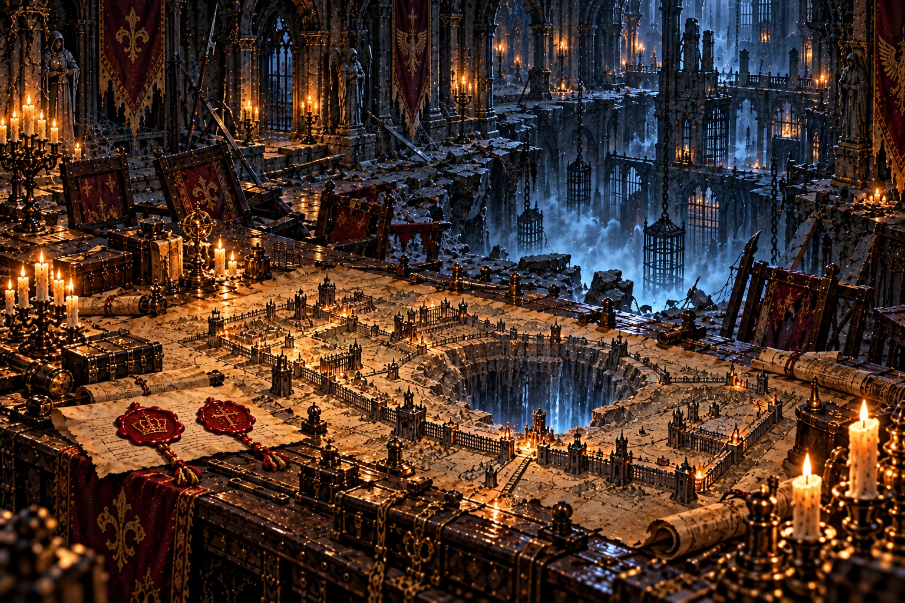

**ストーリー一覧の本文**

> 砦の主が最後まで立てこもった本丸。軍議の間には、いまも将たちの亡霊が卓を囲む
>
> 本丸は、砦を守る最後の命令が下された場所だった。軍議の卓には、外郭も地下牢も一枚の地図に描かれている。
>
> だが砦を捨てる命令は、この卓で決まったものではなかった。王家と宰相府の印を帯びた書状が、守備隊の行く末を決めていた。
>
> 本丸の底の大穴は、兵たちの魂が送られた先へ開いている。砦は戦場で失われたのではなく、砦ごと捧げられたのだ。

## lore_w10「根の這う縦穴」 ── 出荷済み

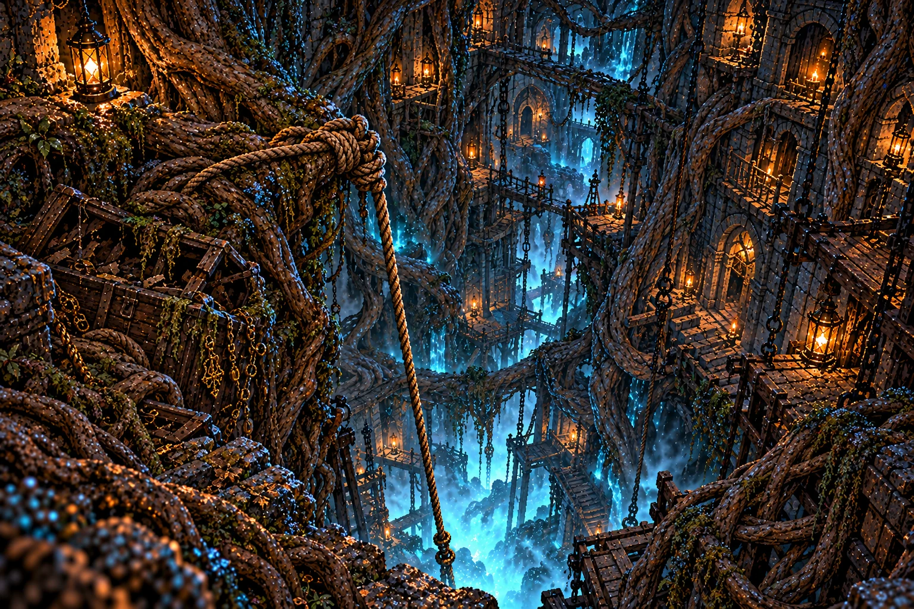

**ストーリー一覧の本文**

> 本丸の床に開いた大穴。壁という壁を太い根が這い、底の見えない闇へ垂れ下がっている
>
> 本丸の大穴の下では、岩を割る根が壁一面を覆う。魂脈と呼ばれたものには、樹皮と樹液があった。
>
> 根は上から流れ込む魂を受け取り、さらに地の底へ運んでいる。自然の穴に見えて、魂の通り道でもあった。
>
> 根に結ばれた綱は、人の手によるものだ。誰かがこの流れを追い、地上へ戻る道を捨てて下へ降りた。

## lore_w11「地の底の霧森」 ── 出荷済み

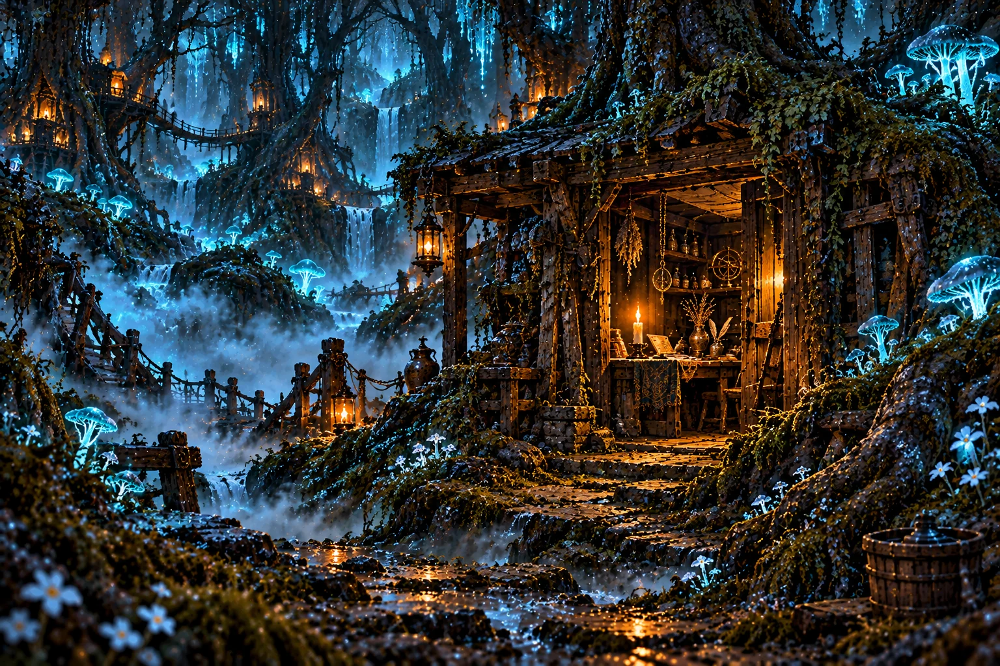

**ストーリー一覧の本文**

> 縦穴の底に広がる、陽の届かない森。木々は魂の灯で淡く光り、霧が階ごとに姿を変える
>
> 地の底の森には、陽の光が届かない。それでも木は育ち、霧の中で死者の気配が枝を渡る。
>
> 木を育てるのは水だけではない。地下へ送られた魂が、葉と幹の中に取り込まれていた。
>
> 小屋の跡は、この森で人が暮らした証だ。霧は道を変えても、そこで誰かが灯を守った時間までは消せなかった。

## lore_w12「樹液の苗床」 ── 出荷済み

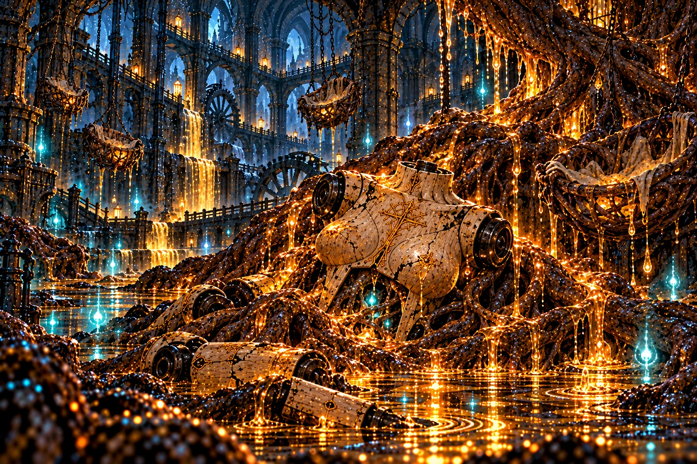

**ストーリー一覧の本文**

> 大樹の根が魂を溶かし、樹液に変える苗床。甘い香りが傷を癒し、魔物までも癒す
>
> 苗床に満ちる樹液は、傷ついた者へ力を返す。人業も魔物も、その甘い流れに癒される。
>
> だが根の間には、器の欠片が埋まっていた。命を返すように見える場所が、別の命を取り込んでいる。
>
> 苗床は森の育つ場所であり、魂の姿がほどける場所でもあった。そこに残された木の胴は、流れに呑まれた旅の証だった。

## lore_w13「魂喰らいの大樹」 ── 出荷済み

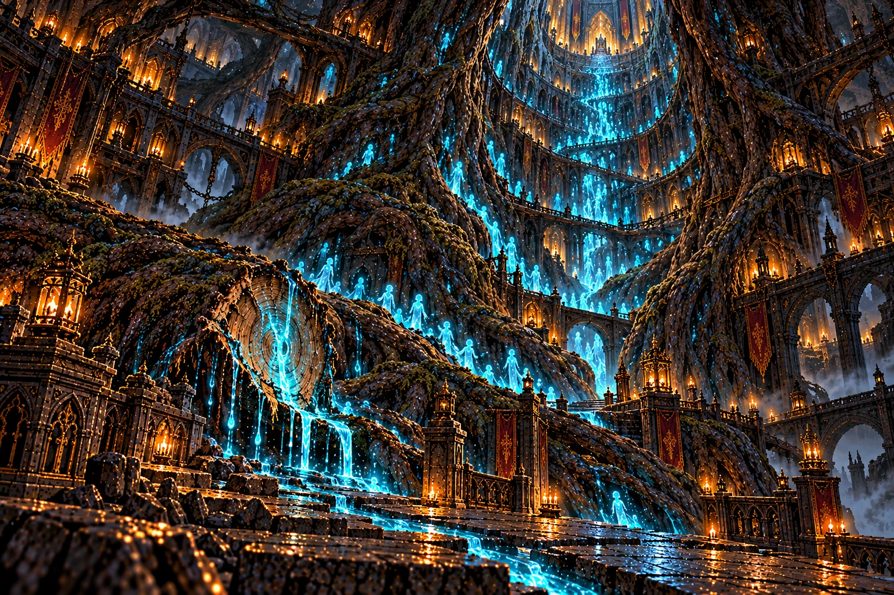

**ストーリー一覧の本文**

> 百の迷宮から魂を吸い上げる大樹の根元。幹は王都へ向かって、地の底を這い上がっている
>
> 大樹の根は砦の下まで届き、幹はさらに上へ伸びている。魂脈は、この木のために魂を運ぶ根だった。
>
> 主の記憶に残っていたのは、根を断って幹へ入ったオルドの姿。木を三百年育ててきたのは、宰相モルデンだった。
>
> 幹の行き着く先は王都の玉座の下。地の底の森は辺境の災いではなく、王国の中心へつながっていた。

## lore_w14「水底の参道」 ── 保留 (直し待ち)

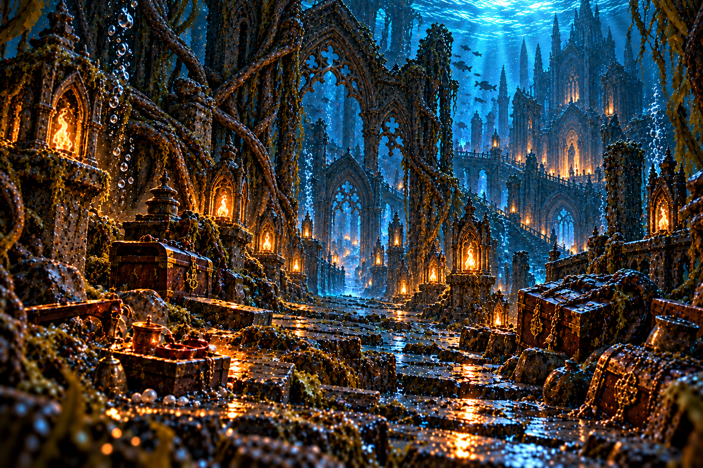

**ストーリー一覧の本文**

> 王都の地下水路のさらに下。三百年前に沈んだ旧都の参道が、灯籠を連ねて水の底へ続いている
>
> 参道は、旧都の人々が大神殿へ向かうために敷いた道だった。灯籠は祈りの数だけ並べられ、沈んだ後も水の底で列を崩さない。
>
> 供物は神へ捧げられたものではなかった。泉に植えられた苗木が、それを糧に根を伸ばしていた。
>
> 今も灯籠に灯がともるのは、参道を歩いた者の名残が、帰り道を探しているからなのかもしれない。

**修正 A-21**

- 直す: 鳥居・しめ縄・日本式の石灯籠で和風の神社になっている → 旧都はゴシックの都。`chapter4/w14_lamp.png` と同じ、祠の形のゴシックの石灯籠の列が水底の参道に並ぶ。根・沈んだ供物の宝箱は保つ。直したら `tools/storyart/hold.json` の `hold` から外し、`python3 tools/storyart/build.py` を回す (1-3)。

## lore_w15「溺れた聖歌の回廊」 ── 出荷済み

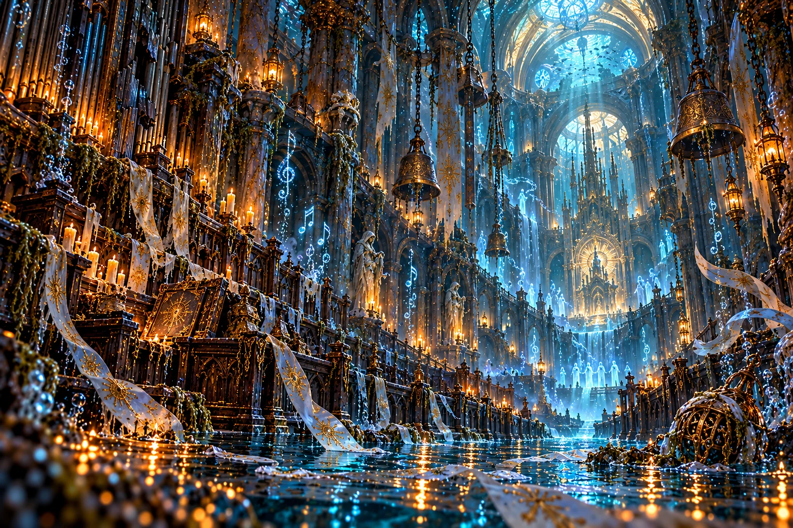

**ストーリー一覧の本文**

> 旧都の大神殿へ続く回廊。水に沈んだ聖歌隊が、三百年、同じ歌を歌い続けている
>
> 回廊の聖歌隊は、都が沈む夜も歌をやめなかった。水が胸まで満ちても、最後の一節を歌い切ろうとした。
>
> 壁画は、戴冠の喜びを描くために作られた。けれど絵の中の誰も、脇に立つ神官の苗木を気にかけていない。
>
> 歌は三百年同じ節を繰り返している。終わりを迎えられなかった祈りが、回廊を出られずにいる。

## lore_w16「洗礼の大水槽」 ── 保留 (直し待ち)

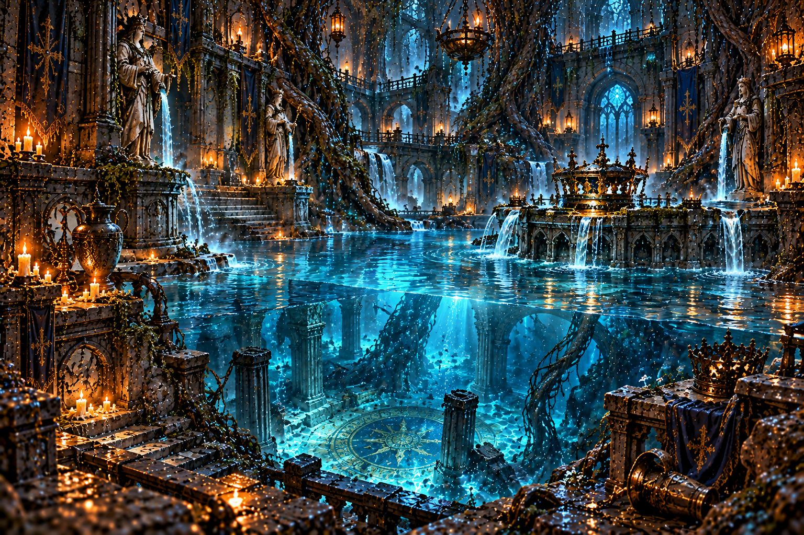

**ストーリー一覧の本文**

> 王が冠を受ける前に身を清めた、旧都の洗礼の水槽。いまは大樹の根が水を吸い、底は昏い
>
> 大水槽は、王が冠を受ける前に身を清める場所だった。民を守るという誓いは、この水に映して立てられた。
>
> 泉の苗木が根を伸ばしてから、水は少しずつ濁った。澄んだまま残る泉は、誓いの名残だけをたたえている。
>
> 根は水を吸い、流れてきたものを抱え込む。底に絡まっていたのは、どこかへ帰ろうとしていた器だった。

**修正 A-22**

- 直す: 本文は「水は少しずつ濁った。澄んだまま残る泉は、誓いの名残だけ」「底に絡まっていたのは、どこかへ帰ろうとしていた器」。いまの絵は全体が澄んだ明るい水 → 大水槽の水は暗く濁らせ、澄んだ泉が二つだけ光る。底の根に木の脚 (セラの脚) がかすかに絡む。直したら同じく `hold` から外して build.py を回す。

## lore_w17「沈める大神殿」 ── 出荷済み

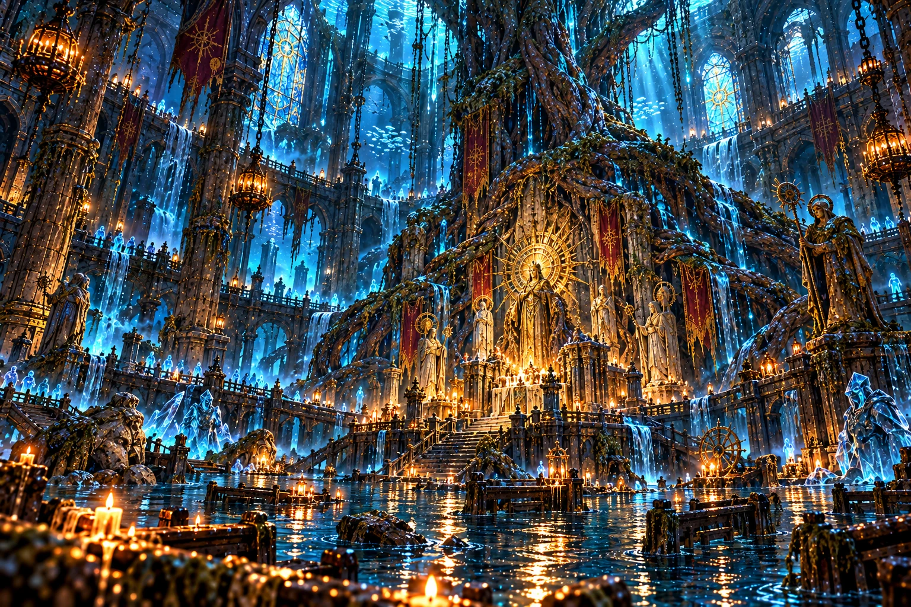

**ストーリー一覧の本文**

> 旧都の王が冠を受けた大神殿。三百年前、一夜にして水に沈んだ。大樹の幹が、祭壇を突き破って昇っている
>
> 大神殿は、旧都の王たちが冠を受けた場所だった。祭壇の前には、魂の湧く泉があったという。
>
> 泉に苗木が植えられた夜、床は割れ、都は水に沈んだ。王は止められなかったものを、水の底から見続けた。
>
> 大樹の幹は祭壇を突き破り、今の王都の玉座へ向かって昇っている。旧い王の座の上に、新しい王の座が建てられていた。

## lore_w18「火を噴く地割れ」 ── 未着手

_(絵はまだ無い)_

**ストーリー一覧の本文**

> 大神殿の底の割れ目から、熱い風が吹き上げる。岩は赤く脈打ち、足元から火が噴き出す
>
> 地割れは、大樹の樹液を煮る熱が地の底から漏れ出した跡だった。岩は熱を帯び、脈打つように赤く光る。
>
> 鉄の扉は、火の洞を外から隠すために据えられた。開ける者を拒むのではなく、中のことを知らせないための扉だった。
>
> 扉をこじ開けた刃は、根を断つために研がれたものだった。断たれた根の先に、煮詰める釜があった。

## lore_w19「灰の降る祭場」 ── 未着手

_(絵はまだ無い)_

**ストーリー一覧の本文**

> 火を拝む者たちが集った地下の祭場。天井から灰が降り続け、焼かれた人業の殻が積み上がっている
>
> 祭場では、火を拝む者たちが釜の火に祈りを捧げていた。燃えるものは何でも、火への供え物になった。
>
> 積まれた人業の殻は、魂を宿す前に壊れた器だった。似た顔ばかりなのは、作った者が同じ形を求め続けたからだ。
>
> 灰は今も降り続ける。焼かれた器の灰が、祈る者たちの肩に積もっていく。

## lore_w20「魂を煮る釜場」 ── 未着手

_(絵はまだ無い)_

**ストーリー一覧の本文**

> 大樹の樹液を煮詰めて霊薬に変える釜が、いくつも並ぶ。釜の火は、迷宮に呑まれた魂でできている
>
> 釜場には、大樹の樹液を煮詰める釜が並ぶ。煮詰まった滴は、金の杯に受けられて王のもとへ運ばれた。
>
> 釜の火を絶やさないために、迷宮に呑まれた魂がくべられた。帳面は、その数を三百年書き留めてきた。
>
> 魂を使わない薬の作り方は、釜の前で見つけられた。同じ火の前で、別の作り方を考えた人がいたのだ。

## lore_w21「業火の大釜」 ── 未着手

_(絵はまだ無い)_

**ストーリー一覧の本文**

> 火の洞の底の大釜。三百年、魂の樹液を煮詰め続けてきた。釜の底には、底の無い穴が口を開けている
>
> 大釜は、火の洞のいちばん底に据えられていた。樹液はここで最後に煮詰められ、王の霊薬になる。
>
> 釜の下には、底の見えない穴がある。魂の流れはその奥から湧き、またその奥へ落ちていく。
>
> 火の洞の者たちは、その穴を奈落と呼んだ。大釜は、奈落の口に蓋をするように置かれていた。

## lore_w22「奈落の氷棚」 ── 未着手

_(絵はまだ無い)_

**ストーリー一覧の本文**

> 大釜の底の穴を降りると、壁から氷の棚が張り出している。吹き上げる風が、落ちてくる魂を凍らせて受け止める
>
> 奈落の壁には、吹き上げる風で凍った氷の棚が、らせんを描いて張り出している。
>
> 風は落ちてくるものを壁へ吹き寄せ、氷が受け止める。棚に凍りついた品々は、落ちていった者たちの持ち物だ。
>
> 風に削られた棚は穴だらけで、受け止められたものも、いつかまた下へこぼれていく。

## lore_w23「凍れる操霊師の間」 ── 未着手

_(絵はまだ無い)_

**ストーリー一覧の本文**

> 氷の柱がどこまでも並ぶ広間。柱の一本一本に、人の影が閉じこめられている
>
> 広間の氷の柱には、それぞれ人がひとりずつ閉じこめられていた。どの顔も、眠るように目を閉じている。
>
> 柱の根元に刻まれた名は、王家の記録からは消された名だった。処刑されたはずの者たちが、氷の中で長い年月を過ごしていた。
>
> 凍りきれずに柱からこぼれた者は、半ば凍ったまま広間を歩く。眠りたくても眠れないのは、氷が浅かったからだ。

## lore_w24「極光の氷窟」 ── 未着手

_(絵はまだ無い)_

**ストーリー一覧の本文**

> 天井に極光がゆらめく氷の洞窟。光の正体は、氷に閉じこめられた無数の魂だという
>
> 氷窟の天井の極光は、空の光ではない。氷に閉じこめられた無数の魂が、ゆっくりと瞬いている。
>
> 光の加減で、魔物の気配まで揺らぐ。この洞窟では、確かなものなど何ひとつない。
>
> 氷の中には、古い金貨も光っていた。魂と一緒に落ちてきた、誰かの暮らしの名残だ。

## lore_w25「凍てつく大回廊」 ── 未着手

_(絵はまだ無い)_

**ストーリー一覧の本文**

> 奈落の壁をめぐる、氷の大回廊。いちばん奥に、氷の玉座があるという
>
> 大回廊は、奈落の壁をめぐる氷の道だった。奥へ進むほど冷気は深く、足が言うことを聞かなくなる。
>
> 回廊の奥の玉座には、三百年、ひとりの操霊師が座っていた。落ちていく魂を止めるために、自分ごと氷になって。
>
> 堤が解けた今、氷の水はさらに下へと流れ落ちている。回廊は、もう何も受け止めない。

## lore_w26「腐れ水の岸」 ── 未着手

_(絵はまだ無い)_

**ストーリー一覧の本文**

> 解けた氷の水が滝になって落ちる、奈落の底の沼の岸。黒い泥は、底まで落ちた魂が腐ったものだという
>
> 解けた氷の水は、奈落の壁を伝って滝になり、底の沼へ落ちていく。岸の泥は黒く、踏むとかすかに温かい。
>
> 泥の黒さは、底まで落ちた魂が腐ったものだ。腐った魂は毒になり、岸のあちこちを沼に変えている。
>
> 落ちてきたばかりの魂は、岸に溜まってまだ光っている。腐りきる前に拾えば、器に宿すこともできる。

## lore_w27「器の捨て場」 ── 未着手

_(絵はまだ無い)_

**ストーリー一覧の本文**

> 沼のほとりの谷に、作りかけの人業が山と積まれている。動かないはずの器が、ときどき起き上がる
>
> 沼のほとりの谷には、作りかけの人業が山と積まれていた。どれも三百年よりも古い。
>
> 胸の扉の内側には、灯を掌に載せた手の印。一門の祖が作っては、仕上がらずに捨てた器たちだった。
>
> 魂の入らなかった器は、沼の瘴気を吸って、ときどき起き上がる。胸に入れるものを探して、谷をさまよう。

## lore_w28「毒霧の葦原」 ── 未着手

_(絵はまだ無い)_

**ストーリー一覧の本文**

> 背丈を越える葦の原。毒の霧が立ちこめ、葦のあいだを何かが這い回る
>
> 葦原の葦は、腐った魂を吸って背丈を越えるほどに伸びた。葉の先から、毒の霧がにじみ出ている。
>
> 霧の中では、すぐそばにいる者の姿さえ見えない。葦のあいだを這うものは、その霧を味方にして獲物を待つ。
>
> 葦の根元には、沼へ落ちた古い金貨が絡みついている。魂と一緒に落ちてきた、誰かの暮らしの名残だ。

## lore_w29「よどみの底」 ── 未着手

_(絵はまだ無い)_

**ストーリー一覧の本文**

> 沼のいちばん深いところ。腐った魂がよどみ、底には古い島が沈みかけている
>
> よどみの底は、沼のいちばん深いところ。三百年よりも前から、腐った魂がここへ流れこみ、よどみ続けてきた。
>
> 底の島には、灯の印を掲げた古い工房があった。一門の祖は、ここで落ちてくる魂が腐るのを見ていた。
>
> 主は、ただひとつ仕上がった器に言いつけを残して死んだ。工房の奥の扉の向こうには、嵐の鳴る塔が上へ伸びている。

## lore_w30「風鳴りの螺旋」 ── 未着手

_(絵はまだ無い)_

**ストーリー一覧の本文**

> 沼の島の工房の奥から、塔の螺旋階段が闇の上へ伸びている。吹き抜けを、下から風が鳴りながら昇っていく
>
> 沼の島の工房の奥から、塔の螺旋階段が奈落の縦穴をまっすぐ上へ伸びている。石を積んだのは、一門の祖とその人業だった。
>
> 階段のまん中は底まで吹き抜けで、下から風が鳴りながら昇っていく。風は、底から吹き上げられた魂の流れだ。
>
> 師は雷に杖を焼かれ、手すりの鎖を伝って登っていった。鎖には、いまも手でつかんだ跡が残っている。

## lore_w31「嵐を鳴らす鐘楼」 ── 未着手

_(絵はまだ無い)_

**ストーリー一覧の本文**

> 塔の中ほどに吊られた、いくつもの大鐘。嵐が吹き抜けるたび、誰も撞かない鐘が鳴りわたる
>
> 塔の中ほどには、一門の印を刻んだ大鐘がいくつも吊られている。鳴るたびに、ひとつの魂が空へ還る ── 鐘にはそう彫られていた。
>
> 鐘は三百年、誰も撞かないのに鳴り続けた。嵐が吹き抜けるたびに、一つ残らず。
>
> 銘の続きは、誰かに削り取られていた。還したはずの魂がどこへ行ったのか、鐘は知らない。

## lore_w32「雷の落ちる回廊」 ── 未着手

_(絵はまだ無い)_

**ストーリー一覧の本文**

> 塔の外壁をめぐる、吹きさらしの回廊。鉄の手すりに、絶え間なく雷が落ちる
>
> 塔の外壁をめぐる回廊は、雷を受けるために造られた。鉄の手すりは、落ちた雷を塔の中へ引きこむ。
>
> 雷は、塔に縛られた魂の火だった。昇ろうとしても昇れない魂が、雲の中でぶつかり合って光る。
>
> 師は手すりに銅を巻き、雷を逃がす仕掛けを作った。後から来る者の器が、焼けずに済むように。

## lore_w33「嵐の尖塔の頂」 ── 未着手

_(絵はまだ無い)_

**ストーリー一覧の本文**

> 塔のいちばん上。渦を巻く雷雲の中心に、火のともらない大きな灯台が立っている
>
> 頂には、火のともらない大きな灯台が立っている。一門の祖は、この灯台に火を入れて、落ちてきた魂を空へ還すつもりだった。
>
> 祖の死後、モルデンは灯台に火を入れた。けれど空へ還った魂は雨になって降り、奈落の底の沼へ落ちて、また腐った。
>
> モルデンは灯台の火を消し、鎖の腕の像を並べて、昇る魂を塔に縛った。縛られた魂の渦が、三百年、この国の空を重くしていた。

## lore_ws1「沈んだ礼拝堂」 ── 出荷済み

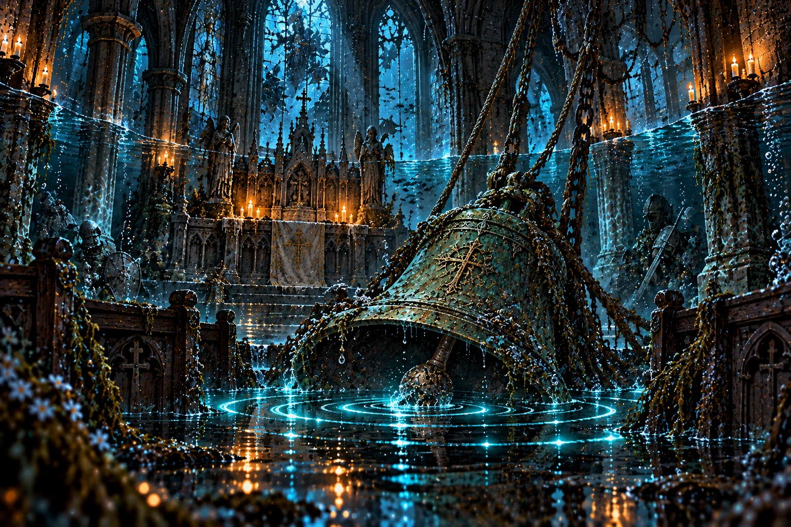

**ストーリー一覧の本文**

> 黒い水の底に沈んだ礼拝堂。夜ごと、水の下から鐘が鳴る
>
> 礼拝堂は、水辺の人々が死者を弔う小さな祈りの場だった。水が床を覆っても、鐘の綱は切られなかった。
>
> 夜ごと聞こえる鐘は、底に沈んだ魂が地上へ居場所を知らせる音だ。祈りの場が失われても、弔いを求める声は残った。
>
> 鐘の周りに集まる魔物は、音に寄せられたものだった。黒い水の下には、忘れられた祈りがまだ響いている。

## lore_ws2「石眠りの石切り場」 ── 出荷済み

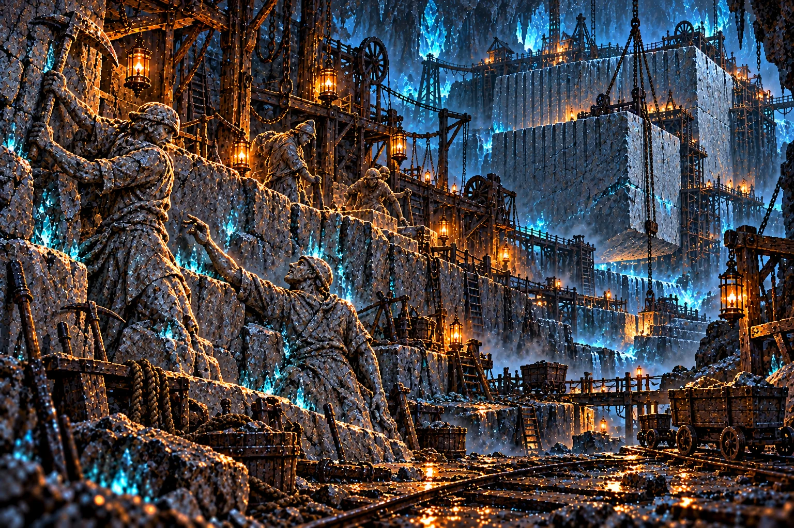

**ストーリー一覧の本文**

> 王都の城壁を切り出した古い石切り場。鉱夫たちは、つるはしを握ったまま石になった
>
> 王都の城壁の石は、この石切り場から運ばれた。鉱夫たちは、誰かを守る壁を作るために岩を切った。
>
> 石になった者の手には、今もつるはしが握られている。仲間を置いて逃げることができず、作業場に残った者たちだ。
>
> 足元の石には、運び出されなかった切り込みが残る。王都を守る仕事の裏に、名も知られない鉱夫たちの眠りがあった。

## lore_ws3「霧の迷い森」 ── 未着手

_(絵はまだ無い)_

**ストーリー一覧の本文**

> 捨て砦の裏手に広がる森。霧が道を食い、胞子が足を取る。迷い込んだ者は二度と同じ道を歩けない
>
> 迷い森の霧は、歩いた道を隠し、覚えていた景色を入れ替える。木につけた印さえ、戻る目印にはならない。
>
> 奥の泉の周りだけには、人が行き来した跡が残っていた。森へ迷い込んだ者たちは、水辺で互いを待っていた。
>
> 帰れなかった者の気配が、新たな旅人を引き止める。霧の恐ろしさには、ひとりで残された者の寂しさも混ざっていた。

## lore_ws4「銀業の隠れ里」 ── 未着手

_(絵はまだ無い)_

**ストーリー一覧の本文**

> 器になりそこねた魂が流れ着く、霧の奥の隠れ里。空の鎧と石の人形が、銀の小人を守っている
>
> 霧の奥の里には、人業の器になれなかった魂が流れ着く。銀の小人たちは、街に住む場所を持たない。
>
> 空の鎧と石の人形は、彼らを狩る者ではなく守る者だった。器を得られなかった魂どうしが、小さな暮らしを支えていた。
>
> 銀の里は宝の山である前に、帰る場所のない魂の隠れ家だった。金属の輝きの奥に、もう一つの生き方が残っている。

## lore_ws5「王都の古井戸」 ── 未着手

_(絵はまだ無い)_

**ストーリー一覧の本文**

> 軍議の卓の地図に、王都の真ん中でひとつだけ赤く囲まれていた井戸。投げ込まれた願いの品が、底に積もっている
>
> 古井戸は、王都の人々が願い事と一緒に金貨を投げ入れる場所だった。三百年分の願いが、底に積もっている。
>
> 願いは叶わないまま沈み、それを喰らって育つものがいた。井戸の水もまた、魂脈へつながっていた。
>
> 軍議の卓の地図がこの井戸を赤く囲んでいたのは、王都でいちばん根に近い場所だったからだ。

## lore_ws6「見捨てられた狼煙台」 ── 未着手

_(絵はまだ無い)_

**ストーリー一覧の本文**

> 捨て砦の外れに立つ狼煙台。援軍を呼ぶ火は百年燃え続け、いまも誰かが薪をくべている
>
> 狼煙台は、捨て砦から王都へ急を知らせるための火の塔だった。火が上がれば、三日で援軍が来る決まりだった。
>
> 最後の夜、狼煙は上がった。次の夜も、その次の夜も上がった。援軍は来なかった。
>
> 火の番たちは、薪が尽きると、砦の扉や旗竿までくべた。火を消すことだけは、最後まで誰もしなかった。

## lore_ws7「獄吏の詰所」 ── 未着手

_(絵はまだ無い)_

**ストーリー一覧の本文**

> 地下牢の番人たちが寝起きした詰所。百年、牢の恨みを浴び続けた獄吏たちは、もう人の強さではない
>
> 詰所には、地下牢の番人たちが寝起きしていた。押収した品は鍵のかかる箱に納め、鍵束はいつも腰に下げていた。
>
> 牢が閉ざされた後も、番人たちは見回りをやめなかった。百年、牢の恨みを浴びながら鍵を数え直すうちに、その体は人の強さを越えていった。
>
> 押収品の中には、操霊師の道具も混じっていた。牢へ送られた者たちが、最後まで手放さなかったものだ。

## lore_ws8「沈んだ書庫」 ── 未着手

_(絵はまだ無い)_

**ストーリー一覧の本文**

> 旧都の書庫の塔。水に沈んでも、棚の書物は一冊も流れ出していない。誰かが、まだ読み手を待っている
>
> 書庫の塔には、旧都の記録が納められていた。王の言葉も、民の願いも、ここで一冊の書になった。
>
> 都が沈む前の夜、司書たちは書を箱に詰めて封をし、塔の扉を内から閉ざした。いつか誰かが読みに来ると信じて。
>
> 棚の奥に、記録の写しが一冊だけ残っていた。泉に苗を植えた若い神官の名は、墨でていねいに塗りつぶされていた。

## lore_ws9「黒曜の切り場」 ── 未着手

_(絵はまだ無い)_

**ストーリー一覧の本文**

> 溶けた岩が冷えて固まった、黒いガラスの崖。割れ口は刃物より鋭く、近づく者を切り刻む
>
> 黒曜の崖は、地の底の熱で溶けた岩が、急に冷えて固まったものだ。火の洞が熱を吐き出すたび、崖は少しずつ伸びている。
>
> 火の洞の者たちは、黒曜を割って刃や鏡にした。鋭すぎる刃は、使う者の手もよく切った。
>
> 崖の割れ口には、古い刃を研いだ跡が残っていた。誰かが、根を断つための刃を、ここで研いでいったのだ。

## lore_ws10「火守りの僧院」 ── 未着手

_(絵はまだ無い)_

**ストーリー一覧の本文**

> 釜の火を絶やさぬよう祈り続けた火守りたちの僧院。祈りが煮つまり、炎の幻が回廊を歩く
>
> 僧院の火守りたちは、釜の火を神の火と信じ、絶やさぬよう祈り続けた。祈りの言葉は、三百年一度も変わらなかった。
>
> 炎の中に見える顔は、祈る者を怖がらせた。逃げた者も、残った者もいた。残った者たちは、目を閉じて祈った。
>
> 僧院の底には、祈りの火を記した帳面があった。いつ、何をくべたか。数だけが、細い字で書き連ねてあった。

## lore_ws11「白狼の吹き溜まり」 ── 未着手

_(絵はまだ無い)_

**ストーリー一覧の本文**

> 吹き上げる風が雪を寄せ集めた、奈落の壁のくぼみ。白霜の狼の群れが、雪煙にまぎれて住みついている
>
> 吹き上げる風は、奈落の壁のくぼみに雪を寄せ集める。吹き溜まりの雪は、いくら降っても底まで固まらない。
>
> 白霜の狼たちは、落ちてきたものを巣へ運んだ。食べられないものまで、ていねいに雪の下へ埋めていた。
>
> 巣の奥には、靴や外套や手紙が積まれていた。狼たちは、落ちてきた者の持ち物を、誰かが取りに来るまで預かっていたのかもしれない。

## lore_ws12「氷河の裂け目」 ── 未着手

_(絵はまだ無い)_

**ストーリー一覧の本文**

> 氷の壁に走る深い裂け目。解けかけた氷の水が細く流れ、氷の中から抜け落ちた者たちがさまよう
>
> 氷の壁の裂け目は、氷がゆっくりと解けはじめたところから広がっている。細い水の流れが、底へ底へと落ちていく。
>
> 氷の柱からこぼれた者たちは、解けた水を追うように、この裂け目へ集まった。行き先を知っているのは、水だけだった。
>
> 裂け目の壁の奥では、凍った魂がまだ光っている。氷が解けきれば、その光もまた下へ流れていく。

## lore_ws13「疫病塚の底」 ── 未着手

_(絵はまだ無い)_

**ストーリー一覧の本文**

> 王都が大疫病の死者を投げこんだ塚の底。塚の穴は、奈落の沼までつながっている
>
> 百年前の大疫病で、王都は死者を城壁の外の塚に投げこんだ。弔いの鐘を鳴らす者は、ひとりもいなかった。
>
> 塚の底の穴は、奈落の沼までつながっていた。病で死んだ魂は、腐りながら病を吸い、ほかのどの魂よりも強くなった。
>
> 夜ごと塚の底で鳴る鐘は、死者たちが自分の手で鳴らしていた。誰も鳴らしてくれなかった弔いの鐘を。

## lore_ws14「沈んだ渡し場」 ── 未着手

_(絵はまだ無い)_

**ストーリー一覧の本文**

> 沼の島へ器を運んだ、古い渡し場。舟はとうに沈み、渡し守の灯だけが霧の中で揺れている
>
> 沼の島へ渡る舟が、かつてこの渡し場から出ていた。客は人ではなく、工房で仕上げを待つ木の器だった。
>
> 島の主が死んでからも、渡し守は灯をともして客を待ち続けた。舟が沈み、自分が沈んでも。
>
> 沈んだ舟には、渡し賃の金貨がまだ残っている。払う者のいなくなった、最後の客の分まで。

## lore_ws15「雷鳥の巣」 ── 未着手

_(絵はまだ無い)_

**ストーリー一覧の本文**

> 塔の外壁に張りついた、雷鳥たちの巨大な巣。巣に住むものは、目にも止まらぬ速さで飛び回る
>
> 塔の外壁に、雷鳥たちが巨大な巣をかけている。巣の材料は、落雷で折れた木と、嵐に吹き上げられた誰かの持ち物だ。
>
> 雷鳥は雷を浴びて育ち、目にも止まらぬ速さで飛ぶ。巣を守るものたちも、いつの間にか同じ速さを身につけた。
>
> 巣の奥には、光るものばかりが集められていた。指輪、ボタン、そして、小さく光る魂のかけら。

## lore_ws16「錆びた避雷針の林」 ── 未着手

_(絵はまだ無い)_

**ストーリー一覧の本文**

> 塔の張り出しに、錆びた鉄の針が林のように立ち並ぶ。針から針へ、青白い火花が渡っていく
>
> 塔の張り出しに、錆びた鉄の針が林のように打たれている。針はどれも、雷を塔の中へ引きこむ向きに立っていた。
>
> 針を打ったのが誰なのか、記した物は残っていない。ただ、針の根元に一門の印が刻まれたものが、いくつかある。
>
> 林の空気はいつも帯電していて、迷いこんだ者の体を少しずつ焼く。針の根元には、焼けた旅人の荷が埋もれている。

## lore_ws17「雲上の庭」 ── 未着手

_(絵はまだ無い)_

**ストーリー一覧の本文**

> 雷雲の上に張り出した、崩れた庭園。誰も世話をしないはずの花が、枯れずに咲いている
>
> 雷雲の上に張り出した庭は、塔を建てた者たちが休むための場所だったらしい。石のベンチが、雲を眺める向きに並んでいる。
>
> 雨は雲の下に降るので、この庭には一滴も落ちない。それでも花は枯れずに咲き、雲から落ちる泉が花を潤してきた。
>
> 花のあいだには、いつも魂が憩っている。昇りきれなかった魂が、ここでひと休みしていくのだという。

