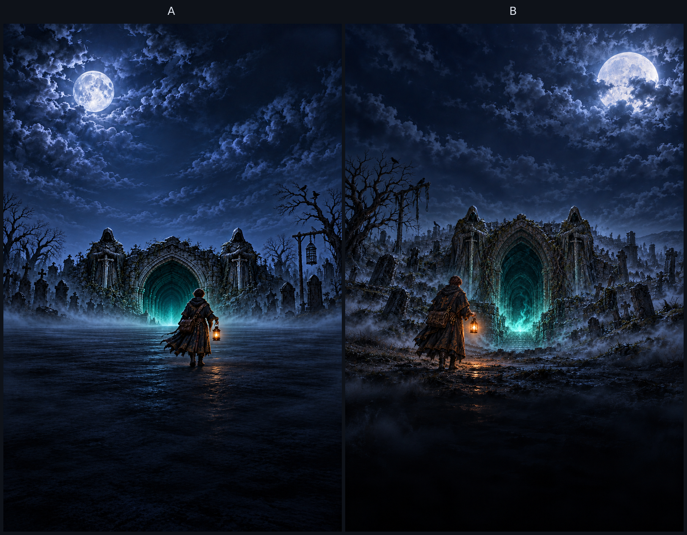

# タイトル縦構図の候補

ユーザーがAを採用。Aをそのまま `../keyart-tall.png` に配置した。A・Bとも別の構図として描き、2:3の全画面を保持している。

| 案 | 構図 | 原画 |
|---|---|---|
| A | 中央の門を正面から捉え、弟子を中央より少し右、月を左上へ置く。左右の巨像で対称のまとまりを作る。 | [tall-a.png](tall-a.png) |
| B | 中央の門へ、左寄りの弟子から視線が向かう。月は右上。墓標と斜めの道で奥行きを作る。 | [tall-b.png](tall-b.png) |

## 制作と確認

- `docs/art/title/README.md`を全文読み、2〜5の場面・三つの光・禁止事項・英語指示をもとに制作。
- 指定の参照は `art/story-review/chapter4/w14_lamp.png`、`art/story-review/prologue/first-descent-gatekeeper.png` の順で渡した。構図調整時は、その後に調整前の生成画像も渡した。
- 弟子は若い成人。小さな頭と長い手足を持つ約7〜8頭身を指定し、茶髪・金の幾何学刺しゅうの黒い外套・茶革の斜め掛け鞄・橙の手提げ灯を維持。
- 生成は各1024×1536。PillowのLanczos補間で1600×2400へ拡大。切り抜き・縦横の変形・描き足し・強い輪郭補正は行っていない。
- 上は夜空・月・雲、下は暗い地面。門と弟子は中央付近へまとめた。
- 画像全体の目視で、後ろ姿、余分な腕、文字・署名・街灯の有無を確認。灯を持つ手は握った形で、反対の腕は外套に隠れるため、指の全数は見えていない。実画面でのロゴ・ボタンとの重なりと光の位置合わせは採用後に確認する。
- 比較画像のA・Bは余白の見出しだけで、原画2枚には文字を加えていない。

## 選択後

採用案を `docs/art/title/keyart-tall.png` にし、同じ場面の3:2横構図を別途描く。拡大原画で光の中心を測って `points.json` を作り、`python3 tools/titleart/build.py` でWebPと登録を生成する。390×844・744×998・1180×820のタイトル画面を撮影し、同じPRへ追加する。

上記は候補提出時点の記録。A採用後の横構図・登録・実画面の確認は [review/README.md](../review/README.md) に記録する。mainへのマージは別の指示を待つ。
