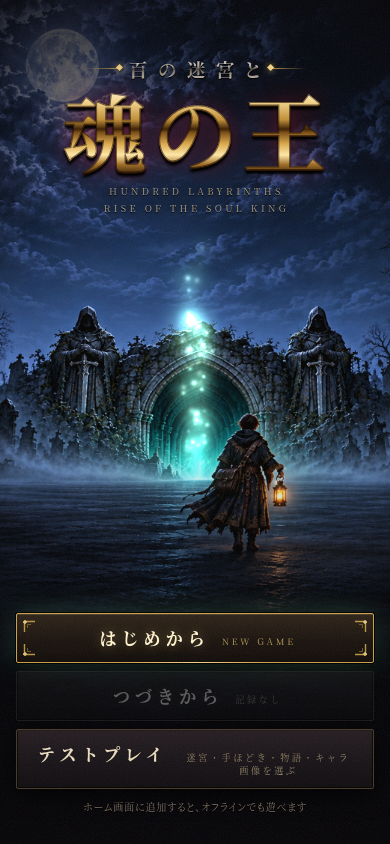
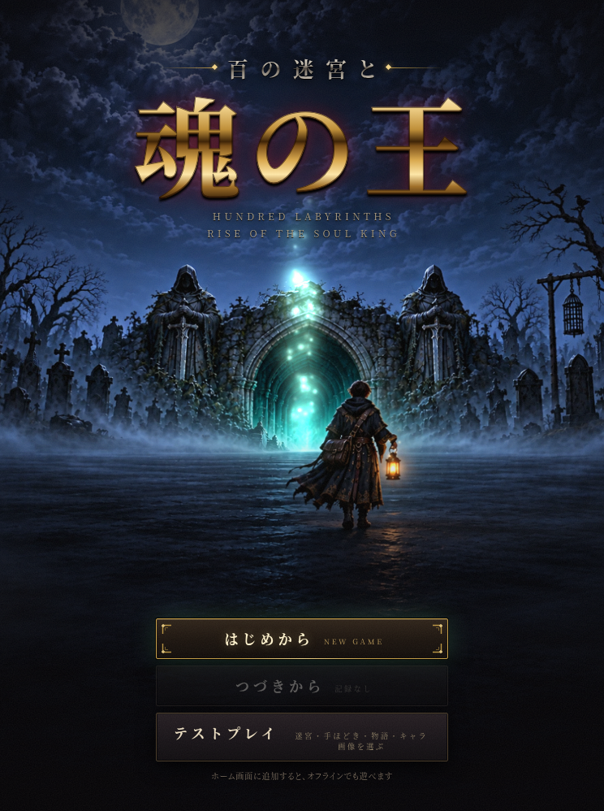
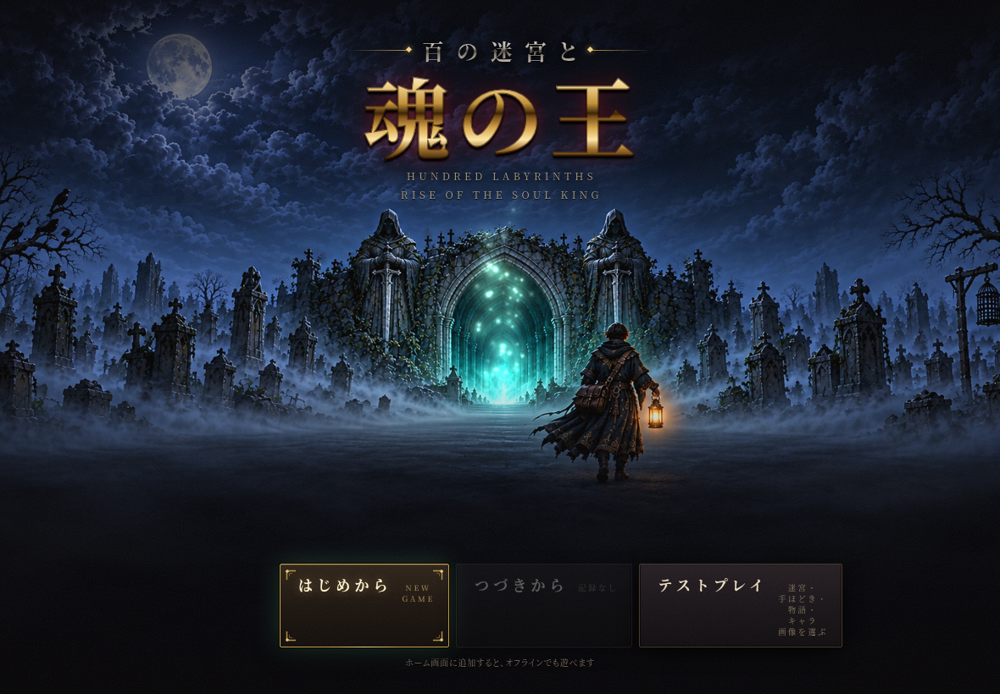
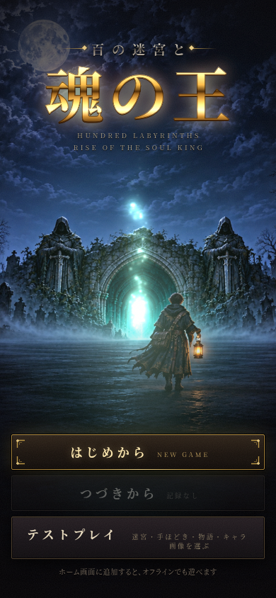

# タイトル原画の採用・実画面確認

ユーザーが縦構図Aを採用。`keyart-tall.png` は `candidates/tall-a.png` とバイト単位で同一。横は同じ墓所・門・弟子・三つの光を保ち、3:2で別途描き下ろした。切り抜きではない。

## 原画と光の測定

| 原画 | 寸法 | 門の光る口の中心（px） | ランタンの火の中心（px） |
|---|---|---|---|
| [縦](../keyart-tall.png) | 1600×2400 | (785, 1385) | (1008, 1468) |
| [横](../keyart-wide.png) | 2400×1600 | (1180, 866) | (1510, 926) |

拡大原画の座標付き部分画像を見て中心を測った。xを幅、yを高さで割った値を [points.json](../points.json) に保存。門の光の半径は高さの0.021、灯は0.0125とし、粒子の出発範囲を門の口付近へまとめた。

生成サイズは縦1024×1536、横1536×1024。PillowのLanczos補間で1.5625倍に拡大し、画面全体の比率と絵を保持した。縦は採用時点で拡大済み。横も切り抜き、描き足し、輪郭の強調は行っていない。[制作記録](../production.json) に参照の順番・指示・測定値を保存した。

`python3 tools/titleart/build.py` がWebP品質90と登録ファイルを生成。縦約410KB、横約371KB。原画はdocs/、art/title/には生成WebPの2枚だけを置いた。`src/titlekeyart.js`・`sw.js`はbuild.pyだけが書き、ゲームのJS/CSSは編集していない。

## タイトル画面

`python3 -m http.server 8000` で配信し、Chromiumで撮影。CSSの表示領域・PNGの寸法とも表のサイズ（DPR 1）。新規状態の実際のタイトル画面で確認した。

| 画面 | 選ばれた原画 | 門の光の中心（画面px、撮影時付近） | 灯の中心（画面px） |
|---|---|---|---|
| 390×844 | 縦 | (197, 464) | (280, 495) |
| 744×998 | 縦 | (374, 535) | (485, 576) |
| 1180×820 | 横 | (594, 458) | (774, 491) |

### スマホ 390×844

### iPad縦 744×998

### 横 1180×820

### 門をタップした時

## 確認結果

- ロゴは夜空の上、ボタンは暗い地面の上で読める。3サイズとも全ボタンが画面内にあり、弟子・ランタンがメニューに重ならない。
- 門の光の中心はロゴ下端とメニュー上端の間。粒子70個の生成範囲が測定した門の口の周辺にあることを実行中の描画クラスで確認し、目視でも口から上へ立ちのぼる。タップ直後は70→106個（36個追加）。
- ランタンのゆらぎと火の粉は測定した火の位置に重なる。原画と光は同じカメラ座標で動くため、寄り引き中も位置が揃う。
- 弟子は若い成人の体格・小さめの頭と長い手足の後ろ姿。茶髪、金の幾何学刺しゅうの黒い外套、茶革の斜め掛け鞄、橙の灯を確認。余分な腕は見られない。灯を握る手に明らかな余分な指は見られないが、握りと袖で隠れる指を含む全数は画像上で数えられない。
- 原画に文字・ロゴ・署名は見られない。画面に出る文字は既存のゲームUI。窓の灯・街の灯・他の人物は描いていない。
- 3サイズともブラウザの実行エラーなし。`build.py --check`、生成JSの構文確認、`git diff --check`を通過。

カメラの位置と粒子数・出発範囲・DOMの寸法の確認値は [verification.json](verification.json) に保存。月や墓所の側端は画面比率によって一部切り取られるが、主題と光の位置は保たれる。mainへのマージは別の指示を待つ。
