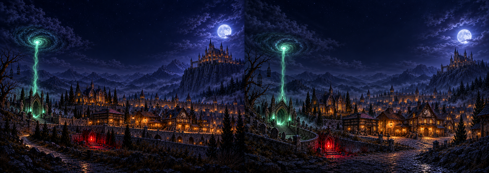

# ロアダル夜景の原画候補

街の上部の夜景を原画に替えるための構図比較。ユーザーの選択を待つ段階で、ゲームへの組み込みはまだ行っていない。

| 案 | 原画 | 構図 |
|---|---|---|
| A | [panorama-a.png](panorama-a.png) | 横に続く城壁と段状の街。左の墓所から街を見渡し、右の王宮を切り立った岩の上に置く |
| B | [panorama-b.png](panorama-b.png) | 曲がる街路と墓地の曲線で奥行きを出す。施設が広場を囲み、王宮へ向かって街が高くなる |

両案とも2400×1700（240:170）。画像生成後、ImageMagickのLanczosフィルターで拡大した（生成解像度を超える細部を復元する超解像ではない）。比較画像は左右それぞれ960×680。

共通の要素は、地下墓所の門・墓地・吊るし籠の枯れ木、青白い緑の魂の柱と渦、城壁と橙の窓、人業の館、吊り灯の酒場、白狼の浮き彫りの宿屋、鉄の帯の商会、紅い魂の小さな祠、岩山の王宮、月と雲。文字・署名は目視で見当たらない。

## 選択後に仕上げること

現在は構図の候補。屋根の位置は指定座標へ完全には一致していない（特に迷宮の門・酒場・宿屋、王宮の塔）。選択後に原画を調整し、札が屋根の上に乗る位置を実画面で確認してから `points.json` に記録する。上空の切り取りで魂の渦がどれだけ見えるかも確認する。

選んだ案を `docs/art/town/panorama.png` に置き、道具からWebP・台帳・SW登録を作る。原画の固定表示、重ねる光と雲・霧・鴉・雷、読み込み失敗時のドット絵、動きを減らす設定を実装し、390×844と744×1000の実画面・全施設の札を検証する。

この段階では `src/`・`sw.js`・`points.json`・`CLAUDE.md` を変更していない。出荷フォルダに候補画像は置いていない。mainへのマージは別途指示を待つ。
