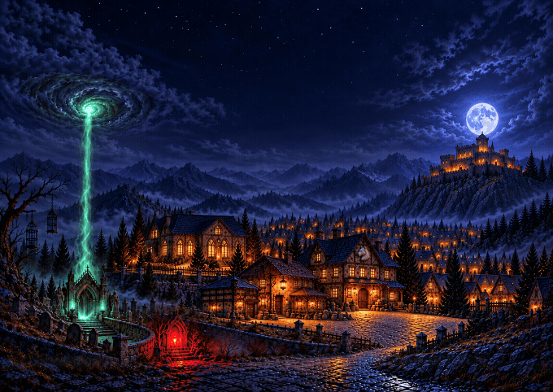
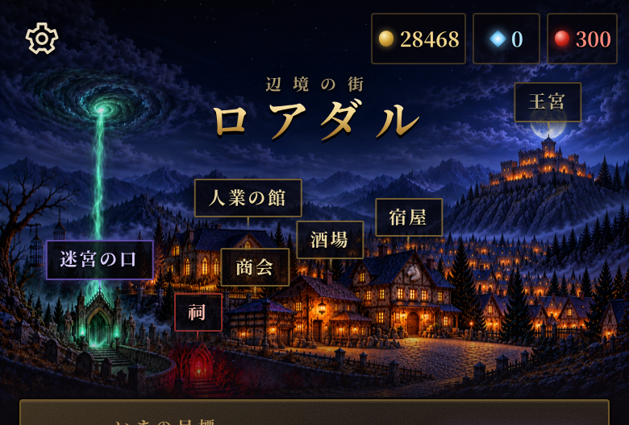
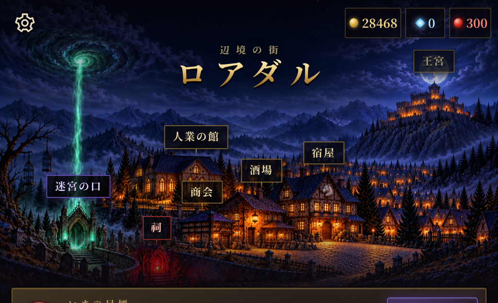
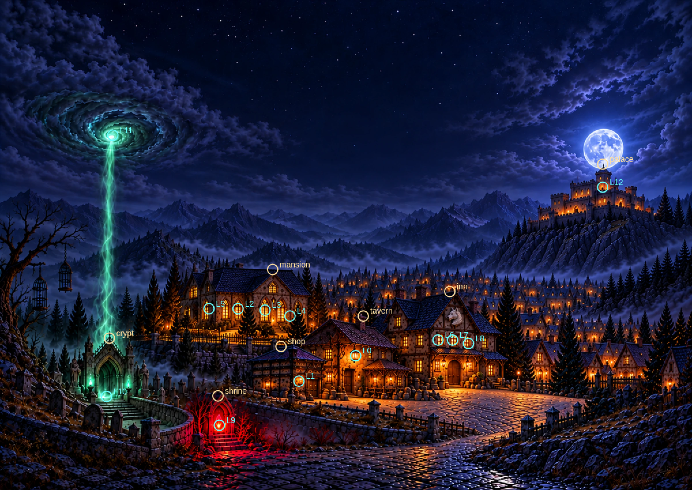

# ロアダルの夜景 ― B案の仕上げと確認

採用されたB案の曲がる街路と墓地の構図を残し、門を小さく、施設を見分けやすい形に調整した。原画は [../panorama.png](../panorama.png)（2400×1700）、出荷は `art/town/panorama.webp`（品質90、約655KB）。上空は暗い雲と月、下部は暗い地面。門の青白い緑、橙の窓と吊り灯、冷たい青紫の月光、紅い祠の4種の光を使う。原画に文字・署名は目視で見当たらない。

原画の生成解像度は1490×1055。Lanczosで2400×1700へ拡大した（細部を新しく復元する超解像ではない）。候補Bと原画は別ファイルで保管している。

## 動く夜景

これはゲームと同じ `paintedTownScene` の描画関数へ8〜22秒の時刻を渡して記録した見本（680px幅・10fps）。実画面では表示幅×画素比のcanvasを20fpsで描く。背景の絵は固定し、雲・霧の流れ、窓と吊り灯のゆらぎ、うねって昇る魂光、魂の渦・祠の脈動、時折の鴉・雲の奥の雷だけを重ねる。GIFは確認用でゲームからは読まない。

## 実画面

`python3 -m http.server 8000` の `http://localhost:8000/?testDungeon=w17&testPlace=town` をChromiumで開いた。画素比は2。

| 390×844 | 744×1000 |
|---|---|
|  |  |
| [画面全体](town-390x844.png) | [画面全体](town-744x1000.png) |

題・通貨・歯車の下は暗い空で読める。札の根元はそれぞれの屋根の上に乗り、7枚の文字の札どうしは重ならない。祠の紅い本体が目標の札に隠れないよう、夜景の箱には札の下の地面も確保した。施設の位置は原画に合わせて測り、[../points.json](../points.json) に記録した。

光の中心と札の根元の照合（この確認画像にだけ印と英字を重ねている。原画・出荷物には入っていない）:

## 操作と代替表示

| 施設 | 390×844 | 744×1000 |
|---|---|---|
| 王宮 | [確認](palace-390x844.png) | [確認](palace-744x1000.png) |
| 人業の館 | [確認](mansion-390x844.png) | [確認](mansion-744x1000.png) |
| 酒場 | [確認](tavern-390x844.png) | [確認](tavern-744x1000.png) |
| 宿屋 | [確認](inn-390x844.png) | [確認](inn-744x1000.png) |
| 商会 | [確認](shop-390x844.png) | [確認](shop-744x1000.png) |
| 迷宮の口 | [確認](crypt-390x844.png) | [確認](crypt-744x1000.png) |
| 祠 | [確認](shrine-390x844.png) | [確認](shrine-744x1000.png) |

どの札も実際に文字の中心をクリックし、開いたタブ・ページ・シートを確認した。宿屋は詳細のシート、迷宮の口は出撃の支度を開く。宿屋の屋根の札も追加し、酒場の心得 `t_town_roofs` に札の使い方を足した。

- [原画未登録](fallback-unregistered.png)・[画像読み込み失敗](fallback-unreadable.png): 従来の240×170のドット絵と名所座標へ戻る。札と箱の切り取りも再計算する。
- [動きを減らす設定](reduced-motion.png): すべての夜景の演出が静止する。最初から静止設定の場合と、表示中に設定を切り替えた場合を検証した。設定を戻すと動きが再開する。
- 表示幅を変えるとcanvasの画素数が追従し、施設から街へ戻っても同じcanvasを使い回す。
- 雲・吊り灯・魂光の領域は時刻で変化し、光を重ねない屋根の領域は変わらないことを画素のハッシュで確認した。
- 両サイズの施設操作でブラウザの例外は0件。

記録は [checks.json](checks.json)。再確認は `python3 tools/townart/review-panorama.py`。原画の登録は `python3 tools/townart/build.py --only panorama`、原画・WebP・台帳・SWの照合は `python3 tools/townart/build.py --check`。指定の全JS構文チェックと `git diff --check` も成功した。
